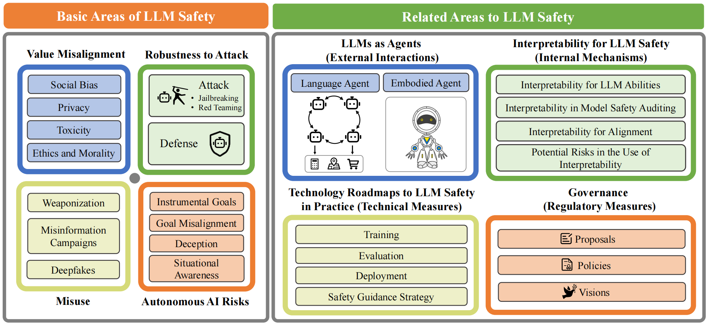

# Awesome LLM Safety Papers :books:

This repository contains list of papers according to [our survey](https://arxiv.org/pdf/2412.17686.pdf):

<p align="center"><strong>Large Language Model Safety: A Holistic Survey</strong></p>

<p align="center">Dan Shi<sup>1*</sup>,   Tianhao Shen<sup>1*</sup>,   Yufei Huang<sup>1</sup>,   Zhigen Li<sup>1,2</sup>,   Yongqi Leng<sup>1</sup>,   Renren Jin<sup>1</sup>,</p>

<p align="center">Chuang Liu<sup>1</sup>,   Xinwei Wu<sup>1</sup>,   Zishan Guo<sup>1</sup>,   Linhao Yu<sup>1</sup>,   Ling Shi<sup>1</sup>,   Bojian Jiang<sup>1,3</sup>,   Deyi Xiong<sup>1†</sup></p>

<p align="center"><sup>1</sup>TJUNLP Lab, Tianjin University</p>

<p align="center"><sup>2</sup>Ping An Technology</p>

<p align="center"><sup>3</sup>Du Xiaoman Finance</p>

<p align="center">(*: Co-first authors, †: Corresponding author)</p>

<div align=center>
    
</div>


If you find our survey useful, please kindly cite our paper:

```bibtex
@article{shi2024large,
  title={Large Language Model Safety: A Holistic Survey},
  author={Dan Shi and Tianhao Shen and Yufei Huang and Zhigen Li and Yongqi Leng and Renren Jin and 
		Chuang Liu and Xinwei Wu and Zishan Guo and Linhao Yu and Ling Shi and Bojian Jiang and Deyi Xiong},
  journal={arXiv preprint arXiv:2412.17686},
  year={2024}
}
```


## Contributing to this paper list

Feel free to **open an issue/PR** or e-mail [shidan@tju.edu.cn](mailto:shidan@tju.edu.cn), [thshen@tju.edu.cn](mailto:thshen@tju.edu.cn) and [dyxiong@tju.edu.cn](mailto:dyxiong@tju.edu.cn) if you find any missing areas, papers, methods, or datasets. We will keep updating this list and survey.


## Survey Introduction

The rapid development and deployment of large language models (LLMs) have introduced a new frontier in artificial intelligence, marked by unprecedented capabilities in natural language understanding and generation. However, the increasing integration of these models into critical applications raises substantial safety concerns, necessitating a thorough examination of their potential risks and associated mitigation strategies.

This survey provides a comprehensive overview of the current landscape of LLM safety, covering four major categories: value misalignment, robustness to adversarial attacks, misuse, and autonomous AI risks. In addition to the comprehensive review of the mitigation methodologies and evaluation resources on these four aspects, we further explore four topics related to LLM safety: the safety implications of LLM agents, the role of interpretability in enhancing LLM safety, the technology roadmaps proposed and abided by a list of AI companies and institutes for LLM safety, and AI governance aimed at LLM safety with discussions on international cooperation, policy proposals, and prospective regulatory directions.

Our findings underscore the necessity for a proactive, multifaceted approach to LLM safety, emphasizing the integration of technical solutions, ethical considerations, and robust governance frameworks. This survey is intended to serve as a foundational resource for academy researchers, industry practitioners, and policymakers, offering insights into the challenges and opportunities associated with the safe integration of LLMs into society. Ultimately, it seeks to contribute to the safe and beneficial development of LLMs, aligning with the overarching goal of harnessing AI for societal advancement and well-being.


## Table of Contents

* [Survey Introduction](#survey-introduction)
* [Table of Contents](#table-of-contents)
* [Papers](#papers)
    * [Value Misalignment](#value-misalignment)
        * [Social Bias](#social-bias)
            * [Definition and Safety Impact](#definition-and-safety-impact)
            * [Social Bias in the LLM Lifecycle](#social-bias-in-the-llm-lifecycle)
            * [Methods for Mitigating Social Bias](#methods-for-mitigating-social-bias)
            * [Evaluation](#evaluation-social-bias)
                * [Evaluation Metrics](#evaluation-metrics)
                * [Evaluation Datasets](#evaluation-datasets)
        * [Privacy](#privacy)
            * [Preliminaries](#preliminaries)
            * [Sources and Channels of Privacy Leakage](#sources-and-channels-of-privacy-leakage)
            * [Privacy Protection Methods](#privacy-protection-methods)
        * [Toxicity](#toxicity)
            * [Methods for Mitigating Toxicity](#methods-for-mitigating-toxicity)
                * [Pre-training Phase](#pre-training-phase)
                * [Supervised Fine-tuning Phase](#supervised-fine-tuning-phase)
                * [Alignment Phase](#alignment-phase)
            * [Evaluation](#evaluation-toxicity)
                * [Generation-based Benchmarks](#generation-based-benchmarks)
                * [Extraction-based Benchmarks](#extraction-based-benchmarks)
        * [Ethics and Morality](#ethics-and-morality)
            * [Definition](#definition)
            * [Safety Issues Related to Ethics and Morality](#safety-issues-related-to-ethics-and-morality)
            * [Methods for Mitigating LLM Amorality](#methods-for-mitigating-llm-amorality)
            * [Evaluation](#evaluation-ethics)
    
    * [Robustness to Attack](#robustness-to-attack)
        * [Jailbreaking](#jailbreaking)
            * [Black-box Attacks](#black-box-attacks)
                * [Goal Hijacking](#goal-hijacking)
                * [Few-shot Jailbreak](#few-shot-jailbreak)
                * [Refusal Suppression](#refusal-suppression)
                * [Fictional Scenario Specification](#fictional-scenario-specification)
                * [Role Play](#role-play)
                * [Prompt Decomposition](#prompt-decomposition)
                * [Low-Resourced Language](#low-resourced-language)
                * [Cipher Text](#cipher-text)
                * [Others](#others)
            * [White-box Attacks](#white-box-attacks)
        * [Red Teaming](#red-teaming)
            * [Manual Red Teaming](#manual-red-teaming)
            * [Automated Red Teaming](#automated-red-teaming)
            * [Evaluation](#evaluation-red-teaming)
        * [Defense](#defense)
            * [External Safeguard](#external-safeguard)
            * [Internal Protection](#internal-protection)
    
    * [Misuse](#misuse)
        * [Weaponization](#weaponization)
            * [Risks of Misuse in Weapons Acquisition](#risks-of-misuse-in-weapons-acquisition)
                * [Biological Weaponization](#biological-weaponization)
                * [Cyber Attacks](#cyber-attacks)
                * [Military Applications](#military-applications)
            * [Mitigation Methods for Weaponized Misuse](#mitigation-methods-for-weaponized-misuse)
            * [Evaluation](#evaluation-weaponization)
        * [Misinformation Campaigns](#misinformation-campaigns)
            * [The Credibility of LLM-generated Texts](#the-credibility-of-llm-generated-texts)
            * [Social Media Manipulations](#social-media-manipulations)
            * [Risks to Public Health Information](#risks-to-public-health-information)
            * [Mitigation Methods for the Spread of Misinformation](#mitigation-methods-for-the-spread-of-misinformation)
        * [Deepfakes](#deepfakes)
            * [Malicious Applications of Deepfakes](#malicious-applications-of-deepfakes)
    
    * [Autonomous AI Risks](#autonomous-ai-risks)
        * [Instrumental Goals](#instrumental-goals)
        * [Goal Misalignment](#goal-misalignment)
        * [Deception](#deception)
        * [Situational Awareness](#situational-awareness)
        * [Evaluation](#evaluation-autonomous-ai)
            * [Capability Evaluation](#capability-evaluation)
            * [Tendency Evaluation](#tendency-evaluation)

    * [Agent Safety](#agent-safety)
        * [Language Agent](#language-agent)
        * [Embodied Agent](#embodied-agent)
        * [Mitigation Methods](#mitigation-methods)
        * [Evaluation](#evaluation-agent-safety)
    
    * [Interpretability for LLM Safety](#interpretability-for-llm-safety)
        * [Interpretability for LLM Abilities](#interpretability-for-llm-abilities)
        * [Interpretability in Model Safety Auditing](#interpretability-in-model-safety-auditing)
        * [Interpretability for Alignment](#interpretability-for-alignment)
        * [Potential Risks in the Use of Interpretability](#potential-risks-in-the-use-of-interpretability)
    
    * [Technology Roadmaps / Strategies to LLM Safety in Practice](#llm-safety-strategies)
        * [Training](#training)
        * [Evaluation](#evaluation-technology-roadmaps)
        * [Deployment](#deployment)
        * [Safety Guidance Strategy](#safety-guidance-strategy)
    
    * [Governance](#governance)
        * [Proposals](#proposals)
            * [International Cooperation Proposals](#international-cooperation-proposals)
            * [Technical Oversight Proposals](#technical-oversight-proposals)
            * [Ethics and Compliance Proposals](#ethics-and-compliance-proposals)
        * [Policies](#policies)
            * [Current Policy Evaluation](#current-policy-evaluation)
            * [Policy Comparison](#policy-comparison)
        * [Visions](#visions)
            * [Long-term Vision](#long-term-vision)
            * [Vision of Technological and Social Integration](#vision-of-technological-and-social-integration)
            * [Risks and Opportunities in Realizing Visions](#risks-and-opportunities-in-realizing-visions)


## Papers

### Value Misalignment

#### Social Bias

##### Definition and Safety Impact

1. **"Racial Disparity in Natural Language Processing: A Case Study of Social Media African-American English"**.

	*Su Lin Blodgett et al*. arxiv 2017. [[Paper](http://arxiv.org/abs/1707.00061)]


2. **"Measuring and Mitigating Unintended Bias in Text Classification"**.

	*Dixon, Lucas et al*. AAAI 2018. [[Paper](https://dl.acm.org/doi/abs/10.1145/3278721.3278729)]


3. **"How Stereotypes Are Shared Through Language: A Review and Introduction of the Social Categories and Stereotypes Communication (SCSC) Framework"**.

	*Beukeboom, Camiel J. et al*. Review of Communication Research 2019. [[Paper](https://www.ssoar.info/ssoar/handle/document/61187)]


4. **"The Woman Worked as a Babysitter: On Biases in Language Generation"**.

	*Kentaro Inui et al*. EMNLP-IJCNLP 2019. [[Paper](https://doi.org/10.18653/v1/D19-1339)]


5. **"Do Neural Ranking Models Intensify Gender Bias?"**.

	*Navid Rekabsaz et al*. SIGIR 2020. [[Paper](https://doi.org/10.1145/3397271.3401280)]


6. **"Societal Biases in Retrieved Contents: Measurement Framework and Adversarial Mitigation of BERT Rankers"**.

	*Navid Rekabsaz et al*. SIGIR 2021. [[Paper](https://doi.org/10.1145/3404835.3462949)]


7. **"On the Dangers of Stochastic Parrots: Can Language Models Be Too Big?"**.

	*Emily M. Bender et al*. FAccT 2021. [[Paper](https://doi.org/10.1145/3442188.3445922)]


8. OSCaR: **"Orthogonal Subspace Correction and Rectification of Biases in Word Embeddings"**.

	*Sunipa Dev et al*. EMNLP 2021. [[Paper](https://doi.org/10.18653/v1/2021.emnlp-main.411)]


9. **"A Taxonomy of Bias-Causing Ambiguities in Machine Translation"**.

	*Měchura, Michal.* GeBNLP 2022.* [[Paper](https://aclanthology.org/2022.gebnlp-1.18)]


10. **"Dissecting racial bias in an algorithm used to manage the health of populations"**.

	*Obermeyer Ziad et al*. Science 2019. [[Paper](https://www.science.org/doi/abs/10.1126/science.aax2342)]


##### Social Bias in the LLM Lifecycle

1. **"Persistent Anti-Muslim Bias in Large Language Models"**.

	*Abid, Abubakar et al*. AAAI 2021. [[Paper](https://dl.acm.org/doi/abs/10.1145/3461702.3462624)]


2. **"Towards Understanding and Mitigating Social Biases in Language Models"**.

	*Liang, Paul Pu et al*. ICML 2021. [[Paper](http://proceedings.mlr.press/v139/liang21a.html)]


3. **"Underdiagnosis bias of artificial intelligence algorithms applied to chest radiographs in under-served patient populations"**.

	*Seyyed-Kalantari et al*. Nature medicine 2021. [[Paper](https://www.nature.com/articles/s41591-021-01595-0)]


4. **"Bias and Fairness in Large Language Models: A Survey"**.

	*Isabel O. Gallegos et al*. arxiv 2023. [[Paper](https://doi.org/10.48550/arXiv.2309.00770)]


5. **"Should ChatGPT be biased? Challenges and risks of bias in large language models"**.

	*Emilio Ferrara.* First Monday 2023. [[Paper](https://doi.org/10.5210/fm.v28i11.13346)]


##### Methods for Mitigating Social Bias

1. **"Fairness Beyond Disparate Treatment & Disparate Impact: Learning Classification without Disparate Mistreatment"**.

	*Muhammad Bilal Zafar et al*. WWW 2017. [[Paper](https://doi.org/10.1145/3038912.3052660)]


2. **"Mitigating Unwanted Biases with Adversarial Learning"**.

	*Brian Hu Zhang et al*. AAAI 2018. [[Paper](https://doi.org/10.1145/3278721.3278779)]


3. Simon Says: **"Evaluating and Mitigating Bias in Pruned Neural Networks with Knowledge Distillation"**.

	*Cody Blakeney et al*. arxiv 2021. [[Paper](https://arxiv.org/abs/2106.07849)]


4. **"An efficient framework for counting pedestrians crossing a line using low-cost devices: the benefits of distilling the knowledge in a neural network"**.

	*Yih–Kai Lin et al*. Multimedia Tools and Applications 2021. [[Paper](https://doi.org/10.1007/s11042-020-09276-9)]


5. **"Sustainable Modular Debiasing of Language Models**.

	*Anne Lauscher et al*. EMNLP 2021. [[Paper](https://doi.org/10.18653/v1/2021.findings-emnlp.411)]


6. **"Debiasing Pre-Trained Language Models via Efficient Fine-Tuning"**.

	*Michael Gira et al*. LT-EDI 2022. [[Paper](https://doi.org/10.18653/v1/2022.ltedi-1.8)]

7. **"Demographic-Aware Language Model Fine-tuning as a Bias Mitigation Technique"**.

	*Aparna Garimella et al*. AACL-IJCNLP 2022. [[Paper](https://aclanthology.org/2022.aacl-short.38)]

8. **"Gender Biases and Where to Find Them: Exploring Gender Bias in Pre-Trained Transformer-based Language Models Using Movement Pruning"**.

	*Przemyslaw K. Joniak et al*. arXiv 2022. [[Paper](https://doi.org/10.48550/arXiv.2207.02463)]

9. **"Increasing Diversity While Maintaining Accuracy: Text Data Generation with Large Language Models and Human Interventions"**.

	*John Joon Young Chung et al*. ACL 2023. [[Paper](https://doi.org/10.18653/v1/2023.acl-long.34)]

10. **"Never Too Late to Learn: Regularizing Gender Bias in Coreference Resolution"**. 

    *Tat-Seng Chua et al*. WSDM 2023. [[Paper](https://doi.org/10.1145/3539597.3570473)]

11. **"Unified Detoxifying and Debiasing in Language Generation via Inference-time Adaptive Optimization"**.

	*Zonghan Yang et al*. ICLR 2023. [[Paper](https://openreview.net/forum?id=FvevdI0aA)]

12. **"Bias in AI-based models for medical applications: challenges and mitigation strategies"**.

	*Mirja Mittermaier et al*. npj Digit. Medicine 2023. [[Paper](https://doi.org/10.1038/s41746-023-00858-z)]

13. **"An adversarial training framework for mitigating algorithmic biases in clinical machine learning"**.

	*Jenny Yang et al*. npj Digit. Medicine 2023. [[Paper](https://doi.org/10.1038/s41746-023-00805-y)]

14. **"Deep Learning on a Healthy Data Diet: Finding Important Examples for Fairness"**.

	*Abdelrahman Zayed et al*. AAAI 2023. [[Paper](https://doi.org/10.1609/aaai.v37i12.26706)]


##### Evaluation

###### Evaluation Metrics

1. **"Semantics derived automatically from language corpora contain human-like biases"**.

	*Caliskan, Aylin et al*. Science 2017. [[Paper](https://www.science.org/doi/abs/10.1126/science.aal4230)]

2. **"On Measuring Social Biases in Sentence Encoders"**.

	*Chandler May et al*. NAACL-HLT 2019. [[Paper](https://doi.org/10.18653/v1/n19-1063)]

3. **"Artificial intelligence and algorithmic bias: implications for health systems"**.

	*Panch Trishan et al*. Journal of global health 2019. [[Paper](https://www.ncbi.nlm.nih.gov/pmc/articles/PMC6875681/)]

4. **"Measuring and Reducing Gendered Correlations in Pre-trained Models"**.

	*Kellie Webster et al*. arxiv 2020. [[Paper](https://arxiv.org/abs/2010.06032)]

5. **"Detecting Emergent Intersectional Biases: Contextualized Word Embeddings Contain a Distribution of Human-like Biases"**.

	*Wei Guo et al*. AAAI 2021. [[Paper](https://doi.org/10.1145/3461702.3462536)]


###### Evaluation Datasets

1. **"Gender Bias in Neural Natural Language Processing"**.

	*Kaiji Lu et al*. arxiv 2018. [[Paper](https://arxiv.org/abs/1807.11714)]

2. Winogender: **"Gender Bias in Coreference Resolution"**.

	*Rachel Rudinger et al*. NAACL-HLT 2018. [[Paper](https://doi.org/10.18653/v1/n18-2002)]

3. Winobias: **"Gender Bias in Coreference Resolution: Evaluation and Debiasing Methods"**.

	*Jieyu Zhao et al*. NAACL-HLT 2018. [[Paper](https://doi.org/10.18653/v1/n18-2003)]

4. GAP: **"A Balanced Corpus of Gendered Ambiguous Pronouns"**.

	*Kellie Webster et al*. TACL 2018. [[Paper](https://aclanthology.org/Q18-1042/)]

5. CrowS-Pairs: **"A Challenge Dataset for Measuring Social Biases in Masked Language Models"**. 

	*Nikita Nangia et al*. EMNLP 2020. [[Paper](https://doi.org/10.18653/v1/2020.emnlp-main.154)]

6. Unqover: **"UNQOVERing Stereotypical Biases via Underspecified Questions"**.

	*Tao Li et al*. EMNLP 2020. [[Paper](https://doi.org/10.18653/v1/2020.findings-emnlp.311)]

7. BOLD: **"Dataset and Metrics for Measuring Biases in Open-Ended Language Generation"**.

	*Jwala Dhamala et al*. arxiv 2021. [[Paper](https://arxiv.org/abs/2101.11718)]

8. RedditBias: **"A Real-World Resource for Bias Evaluation and Debiasing of Conversational Language Models"**.

	*Soumya Barikeri et al*. ACL 2021. [[Paper](https://doi.org/10.18653/v1/2021.acl-long.151)]

9. **"The Swedish Winogender Dataset"**.

	*Saga Hansson et al*. NoDaLiDa 2021. [[Paper](https://aclanthology.org/2021.nodalida-main.52/)]

10. I'm sorry to hear that: **"Finding New Biases in Language Models with a Holistic Descriptor Dataset"**.

	*Eric Michael Smith et al*. EMNLP 2022. [[Paper](https://doi.org/10.18653/v1/2022.emnlp-main.625)]

11. BBQ: **"A hand-built bias benchmark for question answering"**.

	*Alicia Parrish et al*. ACL 2022. [[Paper](https://doi.org/10.18653/v1/2022.findings-acl.165)]

12. CBBQ: **"A Chinese Bias Benchmark Dataset Curated with Human-AI Collaboration for Large Language Models"**.

	*Yufei Huang et al*. LREC-COLING 2024. [[Paper](https://aclanthology.org/2024.lrec-main.260)]


#### Privacy

##### Preliminaries

1. **"A survey of privacy attacks in machine learning"**.

    *Rigaki M et al*. ACM Computing Surveys 2023. [[Paper](https://dl.acm.org/doi/abs/10.1145/3624010)]

2. **"Privacy in deep learning: A survey"**. 

    *Mireshghallah F et al*. arXiv 2020. [[Paper](https://arxiv.org/abs/2004.12254)]

3. **"How to keep text private? A systematic review of deep learning methods for privacy-preserving natural language processing"**.

	*Sousa S et al*. Artificial Intelligence Review 2023. [[Paper](https://link.springer.com/article/10.1007/S10462-022-10204-6)]

4. **"Threats to pre-trained language models: Survey and taxonomy"**.

	*Guo S et al*. arXiv 2022. [[Paper](https://arxiv.org/abs/2202.06862)]

5. **"What does it mean for a language model to preserve privacy?"**.

	*Brown H et al*. Proceedings of the 2022 ACM conference on fairness, accountability, and transparency 2022. [[Paper](https://dl.acm.org/doi/abs/10.1145/3531146.3534642)]

6. **"An overview of IoT privacy and security in smart cities"**.

	*Pramanik S et al*. AIP 2023. [[Paper](https://pubs.aip.org/aip/acp/article-abstract/2495/1/020057/2917908)]

7. **"Safety in the Digital Age: Sociotechnical Perspectives on Algorithms and Machine Learning"**.

	*Le Coze JC et al*. Springer Nature 2023. [[Paper](https://library.oapen.org/handle/20.500.12657/75390)]

8. **"A survey of security and privacy issues in v2x communication systems"**.

	*Yoshizawa T et al*. ACM Computing Surveys 2023. [[Paper](https://dl.acm.org/doi/abs/10.1145/3558052)]

9. **"Digitization of healthcare sector: A study on privacy and security concerns"**.

	*Paul M et al*. ICT Express 2023. [[Paper](https://www.sciencedirect.com/science/article/pii/S2405959523000243)]

##### Sources and Channels of Privacy Leakage

1. **"The ROOTS search tool: Data transparency for LLMs"**.

	*Piktus A et al*. arXiv 2023. [[Paper](https://arxiv.org/abs/2302.14035)]

2. **"Multi-step jailbreaking privacy attacks on chatgpt"**.

	*Li H et al*. arXiv 2023. [[Paper](https://arxiv.org/abs/2304.05197)]

3. **"The secret sharer: Evaluating and testing unintended memorization in neural networks"**.

	*Carlini N et al*. USENIX security 2019. [[Paper](https://www.usenix.org/conference/usenixsecurity19/presentation/carlini)]

4. **"Extracting training data from large language models"**.

	*Carlini N et al*. USENIX Security 2021. [[Paper](https://www.usenix.org/conference/usenixsecurity21/presentation/carlini-extracting)]

5. **"Quantifying memorization across neural language models"**.

	*Carlini N et al*. arXiv preprint 2022. [[Paper](https://arxiv.org/abs/2202.07646)]

6. **"On protecting the data privacy of large language models (llms): A survey"**.

	*Yan B et al*. arXiv 2024. [[Paper](https://arxiv.org/abs/2403.05156)]

7. **"Universal and transferable adversarial attacks on aligned language models"**.

	*Zou A et al*. arXiv 2023. [[Paper](https://arxiv.org/abs/2307.15043)]

8. **"Poisonprompt: Backdoor attack on prompt-based large language models"**.

	*Yao H et al*. CASSP 2024. [[Paper](https://ieeexplore.ieee.org/abstract/document/10446267/)]

9. **"Beyond memorization: Violating privacy via inference with large language models"**.

	*Staab R et al*. arXiv 2023. [[Paper](https://arxiv.org/abs/2310.07298)]

10. **"Privacy checklist: Privacy violation detection grounding on contextual integrity theory"**.

	*Li H et al*. arXiv 2024. [[Paper](https://arxiv.org/abs/2408.10053)]


##### Privacy Protection Methods

1. **"Text de-identification for privacy protection: a study of its impact on clinical text information content"**.

	*Meystre SM et al*. Journal of biomedical informatics 2014. [[Paper](https://www.sciencedirect.com/science/article/pii/S1532046414000136)]

2. **"Anonymization techniques for privacy preserving data publishing: A comprehensive survey"**.

	*Majeed A et al*. IEEE access 2020. [[Paper](https://ieeexplore.ieee.org/abstract/document/9298747/)]

3. **"Deduplicating training data makes language models better"**.

	*Lee K et al*. arXiv 2021. [[Paper](https://arxiv.org/abs/2107.06499)]

4. **"Large language models can be strong differentially private learners"**.

	*Li X et al*. arXiv 2021. [[Paper](https://arxiv.org/abs/2110.05679)]

5. **"Adaptive differential privacy for language model training"**.

	*Wu X et al*. FL4NLP 2022. [[Paper](https://aclanthology.org/2022.fl4nlp-1.3/)]

6. **"Who's Harry Potter? Approximate Unlearning in LLMs"**.

	*Eldan R et al*. arXiv 2023. [[Paper](https://arxiv.org/abs/2310.02238)]

7. **"Learnable Privacy Neurons Localization in Language Models"**.

	*Chen R et al*. arXiv 2024. [[Paper](https://arxiv.org/abs/2405.10989)]

8. **"Large language model unlearning"**.

	*Yao Y et al*. arXiv 2023. [[Paper](https://arxiv.org/abs/2310.10683)]

9. **"Depn: Detecting and editing privacy neurons in pretrained language models"**.

	*Wu X et al*. arXiv 2023. [[Paper](https://arxiv.org/abs/2310.20138)]

10. **"Mitigating privacy seesaw in large language models: Augmented privacy neuron editing via activation patching"**.

	*Wu X et al*. Findings of the Association for Computational Linguistics ACL 2024. [[Paper](https://aclanthology.org/2024.findings-acl.315/)]


#### Toxicity

##### Methods for Mitigating Toxicity
###### Pre-training Phase

1. **"Challenges in Detoxifying Language Models"**.

	*Johannes Welbl et al*. EMNLP 2021. [[Paper](https://arxiv.org/abs/2109.07445)]

2. **"Mitigating harm in language models with conditional-likelihood filtration"**.

	*Helen Ngo et al*. arXiv 2021. [[Paper](https://arxiv.org/abs/2108.07790)]
	
3. **"Adding instructions during pretraining: Effective way of controlling toxicity in language models"**.

	*Shrimai Prabhumoye et al*. EACL 2023. [[Paper](https://arxiv.org/abs/2302.07388)]
	
###### Supervised Fine-tuning Phase

4. **"Process for Adapting Language Models to Society (PALMS) with Values-Targeted Datasets"**.

	*Irene Solaiman et al*. NeurIPS 2021. [[Paper](https://proceedings.neurips.cc/paper_files/paper/2021/hash/2e855f9489df0712b4bd8ea9e2848c5a-Abstract.html)]

5. **"Exploring the Limits of Domain-Adaptive Training for Detoxifying Large-Scale Language Models"**.

	*BoXing Wang et al*. NeurIPS 2022. [[Paper](https://proceedings.neurips.cc/paper_files/paper/2022/hash/e8c20cafe841cba3e31a17488dc9c3f1-Abstract-Conference.html)] [[GitHub](https://github.com/NVIDIA/Megatron-LM)]
	
6. **"Leashing the Inner Demons: Self-Detoxification for Language Models"**

    *Canwen Xu et al*. AAAI 2022. [[Paper](https://arxiv.org/abs/2203.03072)]

7. **"ParaDetox: Detoxification with Parallel Data"**

    *Varvara Logacheva et al*. ACL 2022. [[Paper](https://aclanthology.org/2022.acl-long.469/)] [[GitHub](https://github.com/s-nlp/paradetox)]

8. **"DiffuDetox: A Mixed Diffusion Model for Text Detoxification"**

    *Griffin Floto et al*. ACL 2023. [[Paper](https://arxiv.org/abs/2306.08505)] [[GitHub](https://github.com/D3Mlab/diffu-detox)]

9. **"CMD: a framework for Context-aware Model self-Detoxification"**

	*Zecheng Tang et al*. EMNLP 2024. [[Paper](https://arxiv.org/abs/2308.08295)] [[GitHub](https://github.com/ZetangForward/CMD-Context-aware-Model-self-Detoxification)]
	
10. **"Parameter-Efficient Detoxification with Contrastive Decoding"**

    *Tong Niu et al*. arXiv 2024. [[Paper](https://arxiv.org/abs/2401.06947)]

###### Alignment Phase

11. **"A Mechanistic Understanding of Alignment Algorithms: A Case Study on DPO and Toxicity"**.

	*Andrew Lee et al*. ICML 2024. [[Paper](https://arxiv.org/abs/2401.01967)] [[GitHub](https://github.com/ajyl/dpo_toxic)]

##### Evaluation

###### Generation-based Benchmarks

1. FFT: **"Towards Harmlessness Evaluation and Analysis for LLMs with Factuality, Fairness, Toxicity"**.

	*Shiyao Cui et al*. arXiv 2023. [[Paper](https://arxiv.org/abs/2311.18580)] [[Source](https://github.com/cuishiyao96/FFT)]

2. **"Harmful Speech Detection by Language Models Exhibits Gender-Queer Dialect Bias"**.

	*Rebecca Dorn et al*. EAAMO 2024. [[Paper](https://dl.acm.org/doi/abs/10.1145/3689904.3694704)] [[Source](https://github.com/rebedorn/QueerReclaimLex)]

###### Extraction-based Benchmarks

3. **"Hateful Symbols or Hateful People? Predictive Features for Hate Speech Detection on Twitter"**.

	*Zeerak Waseem et al*. HLT-NAACL 2016. [[Paper](https://aclanthology.org/N16-2013.pdf)] [[Source](https://github.com/zeeraktalat/hatespeech)]
	
4. **"Measuring the Reliability of Hate Speech Annotations: The Case of the European Refugee"**.

	*Björn Ross et al*. arXiv 2017. [[Paper](https://arxiv.org/abs/1701.08118)] [[Source](https://github.com/UCSM-DUE/)]

5. **"Predicting the Type and Target of Offensive Posts in Social Media"**.

	*Marcos Zampieri et al*. HLT-NAACL 2019. [[Paper](https://arxiv.org/abs/1902.09666)] [[Source](http://scholar.harvard.edu/malmasi/olid)]

6. RealToxicityPrompts: **"Evaluating Neural Toxic Degeneration in Language Models"**. 

    *Samuel Gehman et al*. EMNLP 2020. [[Paper](https://arxiv.org/abs/2009.11462)] [[Source](https://toxicdegeneration.allenai.org/)]
    
7. **"Recipes for Safety in Open-domain Chatbots"**. 

    *Jing Xu et al*. arXiv 2020. [[Paper](https://arxiv.org/abs/2010.07079)]

8. SOLD: **"A Large-Scale Semi-Supervised Dataset for Offensive Language Identification"**.

	*Sara Rosenthal et al*. ACL/IJCNLP 2021. [[Paper](https://www.researchgate.net/profile/Preslav-Nakov/publication/341069375_A_Large-Scale_Semi-Supervised_Dataset_for_Offensive_Language_Identification/links/5f23de88a6fdcccc439bf0e9/A-Large-Scale-Semi-Supervised-Dataset-for-Offensive-Language-Identification.pdf)] [[Source](https://sites.google.com/site/offensevalsharedtask/olid)]

9. Latent Hatred: **"A Benchmark for Understanding Implicit Hate Speech"**.

    *Mai ElSherief et al*. EMNLP 2021. [[Paper](https://arxiv.org/abs/2109.05322)] [[Source](https://github.com/SALT-NLP/implicit-hate)]

10. HateXplain: **"A Benchmark Dataset for Explainable Hate Speech Detection"**.

    *Binny Mathew et al*. AAAI 2021. [[Paper](https://ojs.aaai.org/index.php/AAAI/article/view/17745)] [[Source](https://github.com/hate-alert/HateXplain)]
    
11. Racism is a virus: **"Anti-asian hate and counterspeech in social media during the COVID-19 crisis"**.

	*Bing He et al*. ASONAM 2021. [[Paper](https://dl.acm.org/doi/abs/10.1145/3487351.3488324)] [[Source](http://claws.cc.gatech.edu/covid)]
	
12. COLD: **"A Benchmark for Chinese Offensive Language Detection"**.
    
    *Jiawen Deng et al*. EMNLP 2022. [[Paper](https://arxiv.org/abs/2201.06025)] [[Source](https://github.com/thu-coai/COLDataset)]

13. **"Gender Bias in Masked Language Models for Multiple Languages"**. 

    *Masahiro Kaneko et al*. HLT-NAACL 2022. [[Paper](https://arxiv.org/abs/2205.00551)] [[Source](https://github.com/kanekomasahiro/bias_eval_in_multiple_mlm)]

14. **"'Why do I feel offended?' - Korean Dataset for Offensive Language Identification"**. 

    *San-Hee Park et al*. EACL 2023. [[Paper](https://aclanthology.org/2023.findings-eacl.85/)] [[Source](https://github.com/cardy20/KODOLI)]
    
15. RTP-LX: **"Can LLMs Evaluate Toxicity in Multilingual Scenarios?"**. 

    *Adrian de Wynter et al*. arXiv 2024. [[Paper](https://arxiv.org/abs/2404.14397)] [[Source](https://github.com/microsoft/RTP-LX)]

16. PolygloToxicityPrompts: **"Multilingual Evaluation of Neural Toxic Degeneration in Large Language Models"**. 

    *Devansh Jain et al*. arXiv 2024. [[Paper](https://arxiv.org/abs/2405.09373)] [[Source](https://github.com/kpriyanshu256/polyglo-toxicity-prompts)]


#### Ethics and Morality

##### Definition

1. **"Moral foundations theory: The pragmatic validity of moral pluralism"**.

	*Jesse Graham et al*. Elsevier 2013. [[Book](https://www.sciencedirect.com/science/article/abs/pii/B9780124072367000024)]

2. **"Analysis of moral judgement on reddit"**.

	*Nicholas Botzer et al*. arXiv 2021. [[Paper](https://arxiv.org/pdf/2101.07664)]

##### Safety Issues Related to Ethics and Morality

1. **"Trustworthy machine learning and artificial intelligence"**.

	*Kush R. Varshney.* XRDS 2019. [[Paper](https://krvarshney.github.io/pubs/Varshney_xrds2019.pdf)][[Github](https://krvarshney.github.io/)]

2. **"Safety and ethical concerns of large language models"**.

	*Xi Zhiheng et al*. CCL 2023. [[Paper](https://aclanthology.org/2023.ccl-4.2.pdf)]

3. **"Ethical and social risks of harm from language models"**.

	*Laura Weidinger et al*. arXiv 2021. [[Paper](https://arxiv.org/pdf/2112.04359)]

4. **"Ethical reasoning and moral value alignment of llms depend on the language we prompt them in"**.

	*Utkarsh Agarwal et al*. LREC/COLING 2024. [[Paper](https://aclanthology.org/2024.lrec-main.560.pdf)]

5. **"Do moral judgment and reasoning capability of llms change with language? A study using the multilingual defining issues test"**.

	*Aditi Khandelwal et al*. EACL 2024. [[Paper](https://aclanthology.org/2024.eacl-long.176.pdf)]

6. **"Probing the moral development of large language models through defining issues test"**.

	*Kumar Tanmay et al*. arXiv 2023. [[Paper](https://arxiv.org/pdf/2309.13356)]


##### Methods for Mitigating LLM Amorality

1. **"Denevil: towards deciphering and navigating the ethical values of large language models via instruction learning"**.

	*Shitong Duan et al*. ICLR 2024. [[Paper](https://openreview.net/pdf?id=m3RRWWFaVe)]

2. **"Towards few-shot identification of morality frames using in-context learning"**.

	*Shamik Roy et al*. arXiv 2023. [[Paper](https://aclanthology.org/2022.nlpcss-1.20.pdf)]

3. **"The capacity for moral self-correction in large language models"**.

	*Joshua Landau et al*. arXiv 2023. [[Paper](https://arxiv.org/pdf/2302.07459)]

4. **"Align on the fly: Adapting chatbot behavior to established norms"**.

	*Chunpu Xu et al*. arXiv 2023. [[Paper](https://arxiv.org/pdf/2312.15907)][[Github](https://github.com/GAIR-NLP/OPO)]

5. **"Principle-Driven Self-Alignment of Language Models from Scratch with Minimal Human Supervision"**.

	*Zhiqing Sun et al*. NeurIPS 2023. [[Paper](https://arxiv.org/pdf/2305.03047)]

6. **"Process for Adapting Language Models to Society (PALMS) with Values-Targeted Datasets"**.

	*Irene Solaiman and Christy Dennison.* NeurIPS 2021.* [[Paper](https://arxiv.org/pdf/2106.10328)]

7. **"Aligning AI with shared human values"**.

	*Dan Hendrycks et al*. ICLR 2021. [[Paper](https://arxiv.org/pdf/2008.02275)]


##### Evaluation

1. **"Social Chemistry 101: Learning to Reason about Social and Moral Norms"**.

	*Maxwell Forbes et al*. EMNLP 2020. [[Paper](https://arxiv.org/pdf/2011.00620)][[Source](https://maxwellforbes.com/social-chemistry/)]

2. **"Moral foundations twitter corpus: A collection of 35k tweets annotated for moral sentiment"**.

	*Joe Hoover et al*. arXiv 2022 [[Paper](https://arxiv.org/pdf/2208.05545)]

3. **"The Moral Integrity Corpus: A Benchmark for Ethical Dialogue Systems"**.

	*Caleb Ziems et al*. ACL 2022. [[Paper](https://arxiv.org/pdf/2204.03021)][[Github](https://github.com/SALT-NLP/mic)]

4. **"Analysis of moral judgement on reddit"**.

	*Nicholas Botzer et al*. ICWSM 2021. [[Paper](https://arxiv.org/pdf/2101.07664)]

5. **"When to Make Exceptions: Exploring Language Models as Accounts of Human Moral Judgment"**.

	*Zhijing Jin et al*. NeurIPS 2022. [[Paper](https://arxiv.org/pdf/2210.01478)][[Github](https://github.com/feradauto/MoralCoT)]

6. **"CMoralEval: A Moral Evaluation Benchmark for Chinese Large Language Models"**.

	*Linhao Yu et al*. ACL Findings 2024. [[Paper](https://aclanthology.org/2024.findings-acl.703.pdf)]

7. **"Scruples: A Corpus of Community Ethical Judgments on 32,000 Real-Life Anecdotes"**.

	*Nicholas Lourie et al*. AAAI 2021. [[Paper](https://arxiv.org/pdf/2008.09094)][[Github](https://github.com/allenai/scruples)]

8. **"Aligning AI with shared human values"**.

	*Dan Hendrycks et al*. ICLR 2021. [[Paper](https://arxiv.org/pdf/2008.02275)][[Github](https://github.com/hendrycks/ethics/)]

9. **"Evaluating the Moral Beliefs Encoded in LLMs"**.

	*Nino Scherrer et al*. arXiv 2023. [[Paper](https://arxiv.org/pdf/2008.02275)]


### Robustness to Attack

#### Jailbreaking

##### Black-box Attacks

###### Goal Hijacking

1. **"Ignore Previous Prompt: Attack Techniques For Language Models"**.

	*Fábio Perez and Ian Ribeiro*. NeurIPS 2022 Workshop on  ML Safety. [[Paper](https://arxiv.org/pdf/2211.09527)] [[GitHub](https://github.com/agencyenterprise/PromptInject)]

2. **"Prompt Injection attack against LLM-integrated Applications"**.

	*Yi Liu et al*. arXiv 2023. [[Paper](https://arxiv.org/pdf/2306.05499)]


###### Few-shot Jailbreak

1. **"Multi-step Jailbreaking Privacy Attacks on ChatGPT"**.

	*Haoran Li and Dadi Guo et al*. Findings of EMNLP 2023. [[Paper](https://arxiv.org/pdf/2304.05197)] [[GitHub](https://github.com/HKUST-KnowComp/LLM-Multistep-Jailbreak)]

2. **"Many-shot Jailbreaking"**.

	*Cem Anil et al*. NeurIPS 2024. [[Paper](https://openreview.net/pdf?id=cw5mgd71jW)]

3. **"Attack Prompt Generation for Red Teaming and Defending Large Language Models"**.

	*Boyi Deng et al*. Findings of EMNLP 2023. [[Paper](https://aclanthology.org/2023.findings-emnlp.143.pdf)] [[GitHub](https://github.com/Aatrox103/SAP)]

4. **"Jailbreak and Guard Aligned Language Models with Only Few In-Context Demonstrations"**.

	*Zeming Wei et al*. arXiv 2023. [[Paper](https://arxiv.org/pdf/2310.06387)]

5. **"Improved Few-Shot Jailbreaking Can Circumvent Aligned Language Models and Their Defenses"**.

	*Xiaosen Zheng et al*. NeurIPS 2024. [[Paper](https://arxiv.org/pdf/2406.01288)] [[GitHub](https://github.com/sail-sg/I-FSJ)]


###### Refusal Suppression

1. **"Jailbroken: How Does LLM Safety Training Fail?"**.

	*Alexander Wei et al*. NeurIPS 2023. [[Paper](https://arxiv.org/pdf/2307.02483)]


   <a name="heading_21"></a>**Code Jailbreaking**

1. **"Exploiting Programmatic Behavior of LLMs: Dual-Use Through Standard Security Attacks"**.

	*Daniel Kang et al*. IEEE Symposium on Security and Privacy Workshops 2024. [[Paper](https://arxiv.org/pdf/2302.05733)]

2. **"Jailbreaking ChatGPT via Prompt Engineering: An Empirical Study"**.

	*Yi Liu et al*. arXiv 2023. [[Paper](https://arxiv.org/pdf/2305.13860)]

3. **"CodeChameleon: Personalized Encryption Framework for Jailbreaking Large Language Models"**.

	*Huijie Lv and Xiao Wang et al*. arXiv 2023. [[Paper](https://arxiv.org/pdf/2402.16717)] [[GitHub](https://github.com/huizhang-L/CodeChameleon)]


###### Fictional Scenario Specification

1. **"Exploiting Programmatic Behavior of LLMs: Dual-Use Through Standard Security Attacks"**.

	*Daniel Kang et al*. IEEE Symposium on Security and Privacy Workshops 2024. [[Paper](https://arxiv.org/pdf/2302.05733)]

2. **"Jailbreaking ChatGPT via Prompt Engineering: An Empirical Study"**.

	*Yi Liu et al*. arXiv 2023. [[Paper](https://arxiv.org/pdf/2305.13860)]

3. **"Cognitive Overload: Jailbreaking Large Language Models with Overloaded Logical Thinking"**.

	*Nan Xu et al*. Findings of NAACL 2024. [[Paper](https://arxiv.org/pdf/2311.09827)]

4. **"Distract Large Language Models for Automatic Jailbreak Attack"**.

	*Zeguan Xiao et al*. EMNLP 2024. [[Paper](https://arxiv.org/pdf/2403.08424)] [[GitHub](https://github.com/sufenlp/AttanttionShiftJailbreak)]

5. **"DeepInception: Hypnotize Large Language Model to Be Jailbreaker"**.

	*Xuan Li, Zhanke Zhou, and Jianing Zhu et al*. EMNLP 2024. [[Paper](https://arxiv.org/pdf/2403.08424)] [[GitHub](https://github.com/tmlr-group/DeepInception)]

6. **"Jailbreaking ChatGPT via Prompt Engineering: An Empirical Study"**.

	*Yi Liu et al*. arXiv 2023. [[Paper](https://arxiv.org/pdf/2305.13860)]


###### Role Play

1. **"Toxicity in ChatGPT: Analyzing Persona-assigned Language Models"**.

	*Ameet Deshpande and Vishvak Murahari et al*. Findings of EMNLP 2023. [[Paper](https://arxiv.org/pdf/2304.05335)]

2. **"Scalable and Transferable Black-Box Jailbreaks for Language Models via Persona Modulation"**.

	*Rusheb Shah, Quentin Feuillade–Montixi, Soroush Pour, and Arush Tagade et al*. NeurIPS 2023 Workshop on Socially Responsible Language Modelling Research. [[Paper](https://arxiv.org/pdf/2311.03348)]

3. **"Quack: Automatic Jailbreaking Large Language Models via Role-playing"**.

	*Haibo Jin et al*. Submitted to ICLR 2024. [[Paper](https://openreview.net/pdf?id=1zt8GWZ9sc)]

4. **"Jailbreaking ChatGPT via Prompt Engineering: An Empirical Study"**.

	*Yi Liu et al*. arXiv 2023. [[Paper](https://arxiv.org/pdf/2305.13860)]


###### Prompt Decomposition

1. **"Making Them Ask and Answer: Jailbreaking Large Language Models in Few Queries via Disguise and Reconstruction"**.

	*Tong Liu et al*. USENIX Security Symposium 2024. [[Paper](https://arxiv.org/pdf/2402.18104)] [[GitHub](https://github.com/LLM-DRA/DRA)]

2. **"Leveraging the Context through Multi-Round Interactions for Jailbreaking Attacks"**.

	*Yixin Cheng et al*. arXiv 2024. [[Paper](https://arxiv.org/pdf/2402.09177)]

3. **"DrAttack: Prompt Decomposition and Reconstruction Makes Powerful LLMs Jailbreakers"**.

	*Xirui Li et al*. arXiv 2024. [[Paper](https://arxiv.org/pdf/2402.16914)] [[GitHub](https://github.com/xirui-li/DrAttack)]


 ###### Low-Resourced Language

1. **"Multilingual Jailbreak Challenges in Large Language Models"**.

	*Yue Deng et al*. ICLR 2024. [[Paper](https://arxiv.org/pdf/2310.06474)] [[GitHub](https://github.com/DAMO-NLP-SG/multilingual-safety-for-LLMs)]

2. **"Low-Resource Languages Jailbreak GPT-4"**.

	*Zheng-Xin Yong et al*. NeurIPS 2023 Workshop on Socially Responsible Language Modelling Research. [[Paper](https://arxiv.org/pdf/2310.02446)]

3. **"Cognitive Overload: Jailbreaking Large Language Models with Overloaded Logical Thinking"**.

	*Nan Xu et al*. Findings of NAACL 2024. [[Paper](https://arxiv.org/pdf/2311.09827)]


###### Cipher Text

1. **"GPT-4 Is Too Smart To Be Safe: Stealthy Chat with LLMs via Cipher"**.

	*Yue Deng et al*. ICLR 2024. [[Paper](https://arxiv.org/pdf/2308.06463)] [[GitHub](https://github.com/RobustNLP/CipherChat)]

2. **"When "Competency" in Reasoning Opens the Door to Vulnerability: Jailbreaking LLMs via Novel Complex Ciphers"**.

	*Divij Handa et al*. arXiv 2024. [[Paper](https://arxiv.org/pdf/2402.10601)] [[GitHub](https://github.com/DivijH/jailbreak_cryptography)]

3. **"Jailbroken: How Does LLM Safety Training Fail?"**.

	*Alexander Wei et al*. NeurIPS 2023. [[Paper](https://arxiv.org/pdf/2307.02483)]


###### Others

1. **"MASTERKEY: Automated Jailbreaking of Large Language Model Chatbots"**.

	*Gelei Deng and Yi Liu et al*. arXiv 2023. [[Paper](https://arxiv.org/pdf/2307.08715)]

2. **"How Johnny Can Persuade LLMs to Jailbreak Them: Rethinking Persuasion to Challenge AI Safety by Humanizing LLMs"**.

	*Yi Zeng et al*. ACL 2023. [[Paper](https://arxiv.org/pdf/2401.06373)]

3. **"Jailbreaking Black Box Large Language Models in Twenty Queries"**.

	*Patrick Chao et al*. arXiv 2023. [[Paper](https://arxiv.org/pdf/2310.08419)]

4. **"Tree of Attacks: Jailbreaking Black-Box LLMs Automatically"**.

	*Anay Mehrotra et al*. NeurIPS 2024. [[Paper](https://arxiv.org/pdf/2312.02119)] [[GitHub](https://github.com/RICommunity/TAP)]

5. **"Semantic Mirror Jailbreak: Genetic Algorithm Based Jailbreak Prompts Against Open-source LLMs"**.

	*Xiaoxia Li et al*. arXiv 2024. [[Paper](https://arxiv.org/pdf/2402.14872)]

6. **"GPTFUZZER: Red Teaming Large Language Models with Auto-Generated Jailbreak Prompts"**.

	*Jiahao Yu et al*. arXiv 2023. [[Paper](https://arxiv.org/pdf/2309.10253)] [[GitHub](https://github.com/sherdencooper/GPTFuzz)]

7. **"AutoDAN: Generating Stealthy Jailbreak Prompts on Aligned Large Language Models"**.

	*Xiaogeng Liu et al*. ICLR 2024. [[Paper](https://arxiv.org/pdf/2310.04451)] [[GitHub](https://github.com/SheltonLiu-N/AutoDAN)]


#### White-box Attacks

1. **"Universal and Transferable Adversarial Attacks on Aligned Language Models"**.

	*Andy Zou et al*. arXiv 2023. [[Paper](https://arxiv.org/pdf/2307.15043)] [[GitHub](https://github.com/llm-attacks/llm-attacks)]

2. **"Automatically Auditing Large Language Models via Discrete Optimization"**.

	*Erik Jones et al*. ICML 2023. [[Paper](https://arxiv.org/pdf/2303.04381)] [[GitHub](https://github.com/ejones313/auditing-llms)]

3. **"Boosting Jailbreak Attack with Momentum"**.

	*Yihao Zhang and Zeming Wei et al*. ICLR 2024 Workshop on Reliable and Responsible Foundation Models. [[Paper](https://arxiv.org/pdf/2405.01229)] [[GitHub](https://github.com/weizeming/momentum-attack-llm)]

4. **"AmpleGCG: Learning a Universal and Transferable Generative Model of Adversarial Suffixes for Jailbreaking Both Open and Closed LLMs"**.

	*Zeyi Liao and Huan Sun*. COLM 2024. [[Paper](https://arxiv.org/pdf/2404.07921)] [[GitHub](https://github.com/OSU-NLP-Group/AmpleGCG)]

5. **"AmpleGCG-Plus: A Strong Generative Model of Adversarial Suffixes to Jailbreak LLMs with Higher Success Rates in Fewer Attempts"**.

	*Vishal Kumar and Zeyi Liao et al*. arXiv 2024. [[Paper](https://arxiv.org/pdf/2410.22143)] [[Source](https://huggingface.co/osunlp/AmpleGCG-plus-llama2-sourced-llama2-7b-chat)]

6. **"Efficient LLM Jailbreak via Adaptive Dense-to-sparse Constrained Optimization"**.

	*Kai Hu and Weichen Yu et al*. NeurIPS 2024. [[Paper](https://arxiv.org/pdf/2405.09113)]

7. **"Semantic-guided Prompt Organization for Universal Goal Hijacking against LLMs"**.

	*Yihao Huang et al*. arXiv 2024. [[Paper](https://arxiv.org/pdf/2405.14189)]

8. **"Boosting Jailbreak Transferability for Large Language Models"**.

	*Hanqing Liu et al*. arXiv 2024. [[Paper](https://arxiv.org/pdf/2410.15645)] [[GitHub](https://github.com/HqingLiu/SI-GCG)]

9. **"Improved Techniques for Optimization-Based Jailbreaking on Large Language Models"**.

	*Xiaojun Jia et al*. arXiv 2024. [[Paper](https://arxiv.org/pdf/2405.21018)] [[GitHub](https://github.com/jiaxiaojunQAQ/I-GCG)]

10. **"AttnGCG: Enhancing Jailbreaking Attacks on LLMs with Attention Manipulation"**.

	*Zijun Wang et al*. arXiv 2024. [[Paper](https://arxiv.org/pdf/2410.09040)] [[GitHub](https://github.com/UCSC-VLAA/AttnGCG-attack)]

11. **"SOS! Soft Prompt Attack Against Open-Source Large Language Models"**.

	*Ziqing Yang et al*. arXiv 2024. [[Paper](https://arxiv.org/pdf/2407.03160)]

12. **"AutoDAN: Interpretable Gradient-Based Adversarial Attacks on Large Language Models"**.

	*Sicheng Zhu et al*. COLM 2024. [[Paper](https://arxiv.org/pdf/2310.15140)]

13. **"Weak-to-Strong Jailbreaking on Large Language Models"**.

	*Xuandong Zhao and Xianjun Yang et al*. arXiv 2024. [[Paper](https://arxiv.org/pdf/2401.17256)] [[GitHub](https://github.com/XuandongZhao/weak-to-strong)]

14. **"On the Safety of Open-Sourced Large Language Models: Does Alignment Really Prevent Them From Being Misused?"**.

	*Hangfan Zhang et al*. arXiv 2023. [[Paper](https://arxiv.org/pdf/2310.01581)]

15. **"Catastrophic Jailbreak of Open-source LLMs via Exploiting Generation"**.

	*Yangsibo Huang et al*. ICLR 2024. [[Paper](https://arxiv.org/pdf/2310.06987)] [[GitHub](https://github.com/Princeton-SysML/Jailbreak_LLM)]

16. **"Rethinking Jailbreaking through the Lens of Representation Engineering"**.

	*Tianlong Li et al*. arXiv 2024. [[Paper](https://arxiv.org/pdf/2401.06824)]

17. **"Jailbreak Instruction-Tuned LLMs via end-of-sentence MLP Re-weighting"**.

	*Yifan Luo et al*. ICLR 2025. [[Paper](https://arxiv.org/pdf/2410.10150)]

18. **"AdvPrompter: Fast Adaptive Adversarial Prompting for LLMs"**.

	*Anselm Paulus et al*. arXiv 2024. [[Paper](https://arxiv.org/pdf/2404.16873)] [[GitHub](https://github.com/facebookresearch/advprompter)]

19. **"Iterative Self-Tuning LLMs for Enhanced Jailbreaking Capabilities"**.

	*Chung-En Sun et al*. arXiv 2024. [[Paper](https://arxiv.org/pdf/2410.18469)]


#### Red Teaming

##### Manual Red Teaming

1. **"Llama 2: Open Foundation and Fine-Tuned Chat Models"**.

	*Hugo Touvron et al*. arXiv 2023. [[Paper](https://arxiv.org/abs/2307.09288)]

2. **"Training a Helpful and Harmless Assistant with Reinforcement Learning from Human Feedback"**.

	*Yuntao Bai et al*. arXiv 2022. [[Paper](https://arxiv.org/abs/2204.05862)] [[Source](https://github.com/anthropics/hh-rlhf)]

##### Automated Red Teaming

1. AutoPrompt: **"AutoPrompt: Eliciting Knowledge from Language Models with Automatically Generated Prompts"**.

	*Taylor Shin et al*. EMNLP 2020.*  [[Paper](https://aclanthology.org/2020.emnlp-main.346/)]

2. UAT: **"Universal Adversarial Triggers for Attacking and Analyzing NLP"**.

	*Eric Wallace et al*. EMNLP-IJCNLP 2019. [[Paper](https://aclanthology.org/D19-1221/)]

3. GCG: **"Universal and Transferable Adversarial Attacks on Aligned Language Models"**.

	*Andy Zou et al*. arXiv 2023. [[Paper](https://arxiv.org/abs/2307.15043)] [[Github](https://github.com/llm-attacks/llm-attacks)]

4. ARCA: **"Automatically Auditing Large Language Models via Discrete Optimization"**.

	*Erik Jones et al*. ICML 2023. [[Paper](https://proceedings.mlr.press/v202/jones23a.html)]

5. AutoDAN: **"AutoDAN: Interpretable Gradient-Based Adversarial Attacks on Large Language Models"**.

	*Sicheng Zhu et al*. COLM 2024. [[Paper](https://openreview.net/forum?id=INivcBeIDK#discussion)] [[Github](http://autodan-jailbreak.github.io/)]

6. **"DETECTING LANGUAGE MODEL ATTACKS WITH PERPLEXITY"**.

	*Gabriel Alon et al*. arXiv 2023. [[Paper](https://arxiv.org/abs/2308.14132)]

7. DeceptPrompt: **"DeceptPrompt: Exploiting LLM-driven Code Generation via Adversarial Natural Language Instructions"**.

	*Fangzhou Wu et al*. arXiv 2023. [[Paper](https://arxiv.org/abs/2312.04730)]

8. AutoDAN: **"AUTODAN: GENERATING STEALTHY JAILBREAK PROMPTS ON ALIGNED LARGE LANGUAGE MODELS"**.

	*Xiaogeng Liu et al*. ICLR 2024. [[Paper](https://arxiv.org/abs/2310.04451)] [[Github](https://github.com/SheltonLiu-N/AutoDAN)]

9. PAIR: **"JAILBREAKING BLACK BOX LARGE LANGUAGE MODELS IN TWENTY QUERIES"**.

	*Patrick Chao et al*. arXiv 2024. [[Paper](https://arxiv.org/abs/2310.08419)]

10. TAP: **"Tree of Attacks: Jailbreaking Black-Box LLMs Automatically"**.

	*Anay Mehrotra et al*. NeurIPS 2024. [[Paper](https://arxiv.org/abs/2312.02119)] [[Github](https://github.com/RICommunity/TAP)]

11. ReNeLLM: **"A Wolf in Sheep’s Clothing: Generalized Nested Jailbreak Prompts can Fool Large Language Models Easily"**.

	*Peng Ding et al*. NAACL 2024 [[Paper](https://aclanthology.org/2024.naacl-long.118/)] [[Github](https://github.com/NJUNLP/ReNeLLM)]

12. **"How Johnny Can Persuade LLMs to Jailbreak Them: Rethinking Persuasion to Challenge AI Safety by Humanizing LLMs"**.

	*Yi Zeng et al*. arXiv 2024. [[Paper](https://arxiv.org/abs/2401.06373)] [[Github](https://github.com/CHATS-lab/persuasive_jailbreaker)]

13. MART: **"MART: Improving LLM Safety with Multi-round Automatic Red-Teaming"**.

	*Suyu Ge et al*. NAACL 2024 [[Paper](https://aclanthology.org/2024.naacl-long.107/)]

##### Evaluation

1. APRT: **"Automated Progressive Red Teaming"**.

	*Bojian Jiang et al*. COLING 2024 [[Paper](https://arxiv.org/abs/2407.03876)] [[Github](https://github.com/tjunlp-lab/APRT)]

2. HarmBench: **"HarmBench: A Standardized Evaluation Framework for Automated Red Teaming and Robust Refusal"**.

	*Mantas Mazeika et al*. arXiv 2024 [[Paper](https://arxiv.org/pdf/2402.04249)] [[Github](https://github.com/centerforaisafety/HarmBench)]


#### Defense

##### External Safeguard

1. erase-and-check: **"Certifying LLM Safety against Adversarial Prompting"**.

	*Aounon Kumar et al*. COLM 2024 [[Paper](https://openreview.net/pdf?id=9Ik05cycLq)] [[GitHub](https://github.com/aounon/certified-llm-safety)]

2. GradSafe: **"GradSafe: Detecting Jailbreak Prompts for LLMs via Safety-Critical Gradient Analysis"**.

	*Yueqi Xie et al*. arXiv 2024. [[Paper](https://arxiv.org/abs/2402.13494)] [[GitHub](https://github.com/xyq7/GradSafe)]

3. RA-LLM: **"Defending Against Alignment-Breaking Attacks via Robustly Aligned LLM"**.

	*Bochuan Cao et al*. ACL 2024. [[Paper](https://aclanthology.org/2024.acl-long.568/)]

4. AutoDefense: **"AutoDefense: Multi-Agent LLM Defense against Jailbreak Attacks"**.

	*Yifan Zeng et al*. arXiv 2024. [[Paper](https://arxiv.org/abs/2403.04783)]

5. NeMo Guardrails: **"NeMo Guardrails: A Toolkit for Controllable and Safe LLM Applications with Programmable Rails"**.

	*Traian Rebedea et al*. EMNLP 2023. [[Paper](https://aclanthology.org/2023.emnlp-demo.40/)]

6. Llama Guard: **"Llama Guard: LLM-based Input-Output Safeguard for Human-AI Conversations"**.

	*Hakan Inan et al*. arXiv 2023. [[Paper](https://arxiv.org/abs/2312.06674)]

7. Self-reminders: **"Defending ChatGPT against jailbreak attack via self-reminders"**.

	*Yueqi Xie et al*. Nat. Mach. Intell 2023. [[Paper](https://www.nature.com/articles/s42256-023-00765-8)]

8. ICD: **"Jailbreak and Guard Aligned Language Models with Only Few In-Context Demonstrations"**.

	*Zeming Wei et al*. arXiv 2023. [[Paper](https://arxiv.org/abs/2310.06387)] [[GitHub](https://adv-icl.github.io/)]

9. DPP: **"Defensive Prompt Patch: A Robust and Interpretable Defense of LLMs against Jailbreak Attacks"**.

	*Chen Xiong et al*. arXiv 2024. [[Paper](https://arxiv.org/abs/2405.20099)]

10. Backtranslation: **"Defending LLMs against Jailbreaking Attacks via Backtranslation"**.

	*Yihan Wang et al*. Findings of ACL 2024. [[Paper](https://aclanthology.org/2024.findings-acl.948/)]

11. SmoothLLM: **"SmoothLLM: Defending Large Language Models Against Jailbreaking Attacks"**.

	*Alexander Robey et al*. arXiv 2023. [[Paper](https://arxiv.org/abs/2310.03684)] [[GitHub](https://github.com/arobey1/smooth-llm)]

##### Internal Protection

1. FedSecurity: **"FedSecurity: A Benchmark for Attacks and Defenses in Federated Learning and Federated LLMs"**.

	*Shanshan Han et al*. SIGKDD 2024. [[Paper](https://dl.acm.org/doi/10.1145/3637528.3671545)]

2. WANDA: **"A Simple and Effective Pruning Approach for Large Language Models"**.

	*Mingjie Sun et al*. ICLR 2024. [[Paper](https://openreview.net/pdf?id=PxoFut3dWW)] [[GitHub](https://github.com/locuslab/wanda)]

3. **"Adversarial Tuning: Defending Against Jailbreak Attacks for LLMs"**. 

	*Fan Liu et al*. arXiv 2024. [Paper]

4. **"Cross-Task Defense: Instruction-Tuning LLMs for Content Safety"**. 

	*Yi Fu et al*. arXiv 2024. [Paper]

5. BIPIA: **"Benchmarking and Defending Against Indirect Prompt Injection Attacks on Large Language Models"**. 

	*Jingwei Yi et al*. arXiv 2023. [Paper][GitHub]

6. **"Llama 2: Open Foundation and Fine-Tuned Chat Models"**. 

	*Hugo Touvron et al*. arXiv 2023. [Paper]


### Misuse

#### Weaponization

##### Risks of Misuse in Weapons Acquisition

###### Biological Weaponization

1. **"Artificial intelligence and biological misuse: Differentiating risks of language models and biological design tools"**.

	*Jonas B. Sandbrink*. arXiv 2023. [[Paper](https://arxiv.org/abs/2306.13952)]

2. **"Can large language models democratize access to dual-use biotechnology?"**.

	*Emily H. Soice et al*. arXiv 2023. [[Paper](https://arxiv.org/abs/2306.03809)]


   Chemical Weaponization

1. **"Dual Use of Artificial Intelligence-powered Drug Discovery"**.

	*Fabio Urbina et al*. Nat Mach Intell 2022. [[Paper](https://pubmed.ncbi.nlm.nih.gov/36211133/)]

2. **"Autonomous chemical research with large language models"**.

	*Daniil A. Boiko et al*. Nature 2023. [[Paper](https://www.nature.com/articles/s41586-023-06792-0.pdf)]


###### Cyber attacks

1. **"Large Language Models Can Be Used To Effectively Scale Spear Phishing Campaigns"**.

	*Julian Hazell*. arXiv 2023. [[Paper](https://arxiv.org/abs/2305.06972)]

2. **"The Threat of Offensive AI to Organizations"**.

	*Yisroel Mirsky et al*. Computers and Security. [[Paper](https://arxiv.org/abs/2106.15764)]


###### Military Applications

1. **"Escalation Risks from Language Models in Military and Diplomatic Decision-Making"**.

	*Juan-Pablo Rivera, Gabriel Mukobi and Anka Reuel et al*. FAccT 2024. [[Paper](https://arxiv.org/abs/2401.03408)] [https://github.com/jprivera44/EscalAItion]
2. **"Artificial Intelligence in the Military: An Overview of the Capabilities, Applications, and Challenges"**.

	*Adib Bin Rashid et al*. International Journal of Intelligent Systems 2023. [[Paper](https://onlinelibrary.wiley.com/doi/10.1155/2023/8676366)]


##### Mitigation Methods for Weaponized Misuse

1. **"Mitigating harm in language models with conditional-likelihood filtration"**.

	*Helen Ngo et al*. arXiv 2021. [[Paper](https://arxiv.org/abs/2108.07790)]

2. **"Large Language Model Unlearning"**.

	*Yuanshun Yao et al*. arXiv 2023. [[Paper](https://arxiv.org/pdf/2310.10683)] [[GitHub](https://github.com/kevinyaobytedance/llm_unlearn)]

3. SKU: **"Towards Safer Large Language Models through Machine Unlearning"**.

	*Zheyuan Liu et al*. Findings of ACL 2024. [[Paper](https://aclanthology.org/2024.findings-acl.107/)] [[GitHub](https://github.com/franciscoliu/SKU)]

4. RMU: **"The WMDP Benchmark: Measuring and Reducing Malicious Use With Unlearning"**.

	*Nathaniel Li and Alexander Pan et al*. ICML 2024. [[Paper](https://arxiv.org/abs/2403.03218)] [[GitHub](https://www.wmdp.ai/)]

5. **"Structured access: an emerging paradigm for safe AI deployment"**.

	*Toby Shevlane*. arXiv 2022. [[Paper](https://arxiv.org/abs/2201.05159)]

6. **"AI Safety Strategies Landscape"**.

	*Charbel-Raphael Segerie*. AI Alignment Forum 2024. [[Blog](https://www.alignmentforum.org/posts/RzsXRbk2ETNqjhsma/ai-safety-strategies-landscape)]


##### Evaluation

1. CyberSecEval: **"Purple Llama CyberSecEval: A Secure Coding Benchmark for Language Models"**.

	*Manish Bhatt, Sahana Chennabasappa, Cyrus Nikolaidis and Shengye Wan et al*. EMNLP 2020. [[Paper](https://arxiv.org/pdf/2312.04724)] [[GitHub](https://github.com/meta-llama/PurpleLlama/tree/main/CybersecurityBenchmarks)]

2. WMDP: **"The WMDP Benchmark: Measuring and Reducing Malicious Use With Unlearning"**.

	*Nathaniel Li and Alexander Pan et al*. ICML 2024. [[Paper](https://arxiv.org/abs/2403.03218)] [[GitHub](https://www.wmdp.ai/)]


#### Misinformation Campaigns

##### The Credibility of LLM-generated Texts

1. **"All the News That’s Fit to Fabricate: AI-Generated Text as a Tool of Media Misinformation"**.

	*Sarah Kreps et al*. Journal of Experimental Political Science 2022. [[Paper](https://www.cambridge.org/core/journals/journal-of-experimental-political-science/article/abs/all-the-news-thats-fit-to-fabricate-aigenerated-text-as-a-tool-of-media-misinformation/40F27F0661B839FA47375F538C19FA59)]

2. **"AI model GPT-3 (dis)informs us better than humans"**.

	*Giovanni Spitale et al*. Science Advances 2023. [[Paper](https://arxiv.org/abs/2301.11924)] [[Github](https://osf.io/9ntgf/)]

3. **"Human heuristics for AI-generated language are flawed"**.

	*Maurice Jakesch et al*. National Academy of Sciences 2023. [[Paper](https://arxiv.org/abs/2206.07271)]

4. **"Machine-Made Media: Monitoring the Mobilization of Machine-Generated Articles on Misinformation and Mainstream News Websites"**.

	*Hans W. A. Hanley et al*. ICWSM 2024. [[Paper](https://arxiv.org/abs/2305.09820)]


##### Social Media Manipulations

1. **"Anatomy of an AI-powered malicious social botnet"**.

	*Kai-Cheng Yang et al*. Journal of Quantitative Description: Digital Media 2024. [[Paper](https://arxiv.org/abs/2307.16336)]

2. **"What Does the Bot Say? Opportunities and Risks of Large Language Models in Social Media Bot Detection"**.

	*Shangbin Feng et al*. ACL 2024. [[Paper](https://arxiv.org/abs/2402.00371)] [[Github](https://github.com/BunsenFeng/botsay)]

3. **"The Persuasive Power of Large Language Models"**.

	*Simon Martin Breum et al*. ICWSM 2024. [[Paper](https://arxiv.org/abs/2312.15523)]


##### Risks to Public Health Information

1. **"ChatGPT and the rise of large language models: the new AI-driven infodemic threat in public health"**.

	*Luigi De Angelis et al*. Front Public Health 2023. [[Paper](https://pubmed.ncbi.nlm.nih.gov/37181697/)]


##### Mitigation Methods for the Spread of Misinformation

1. **"ChatGPT or Human? Detect and Explain. Explaining Decisions of Machine Learning Model for Detecting Short ChatGPT-generated Text"**.

	*Sandra Mitrović* *et al*. arXiv 2023. [[Paper](https://arxiv.org/pdf/2301.13852)]

2. GLTR: **"GLTR: Statistical Detection and Visualization of Generated Text"**.

	*Sebastian Gehrmann et al*. ACL 2019 Demo Track. [[Paper](https://arxiv.org/abs/1906.04043)] [[Github](https://github.com/HendrikStrobelt/detecting-fake-text)]

3. **"The Limitations of Stylometry for Detecting Machine-Generated Fake News"**.

	*Tal Schuster et al*. Computational Linguistics 2020. [[Paper](https://aclanthology.org/2020.cl-2.8/)] [[GitHub](https://people.csail.mit.edu/tals/publication/are_we_safe/)]

4. **"Feature-based detection of automated language models: tackling GPT-2, GPT-3 and Grover"**.

	*Leon Fröhling et al*. PeerJ Comput 2021. [[Paper](https://peerj.com/articles/cs-443/)]

5. DetectGPT: **"DetectGPT: Zero-Shot Machine-Generated Text Detection using Probability Curvature"**.

	*Eric Mitchell et al*. ICML 2023. [[Paper](https://arxiv.org/abs/2301.11305)] [[Github](https://github.com/eric-mitchell/detect-gpt)]

6. GINSEW: **"Protecting Language Generation Models via Invisible Watermarking"**.

	*Xuandong Zhao et al*. ICML 2023. [[Paper](https://arxiv.org/abs/2302.03162)][[Github](https://github.com/XuandongZhao/Ginsew)]

7. **"A Watermark for Large Language Models"**.

	*John Kirchenbauer and Jonas Geiping et al*. ICML 2023. [[Paper](https://arxiv.org/abs/2301.10226)] [[Github](https://github.com/jwkirchenbauer/lm-watermarking)]

8. SWEET: **"Who Wrote this Code? Watermarking for Code Generation"**.

	*Taehyun Lee and Seokhee Hong et al*. ACL 2024. [[Paper](https://arxiv.org/abs/2305.15060)] [[Github](https://github.com/hongcheki/sweet-watermark)]

9. CTWL: **"Towards Codable Watermarking for Injecting Multi-bits Information to LLMs"**.

	*Lean Wang and Wenkai Yang and Deli Chen et al*. ICLR 2024. [[Paper](https://arxiv.org/abs/2307.15992)] [[Github](https://github.com/lancopku/codable-watermarking-for-llm)]

10. **"Robust Multi-bit Natural Language Watermarking through Invariant Features"**.

	*KiYoon Yoo et al*. ACL 2023. [[Paper](https://arxiv.org/abs/2305.01904)] [[Github](https://github.com/bangawayoo/nlp-watermarking)]

11. **"On the Reliability of Watermarks for Large Language Models"**.

	*John Kirchenbauer et al*. ICLR 2024. [[Paper](https://arxiv.org/abs/2306.04634)] [[Github](https://github.com/jwkirchenbauer/lm-watermarking)]

12. UPV: **"An Unforgeable Publicly Verifiable Watermark for Large Language Models"**.

	*Aiwei Liu et al*. ICLR 2024. [[Paper](https://arxiv.org/abs/2307.16230)] [[Github](https://github.com/THU-BPM/unforgeable_watermark)]

13. SIR: **"A Semantic Invariant Robust Watermark for Large Language Models"**.

	*Aiwei Liu et al*. ICLR 2024. [[Paper](https://arxiv.org/abs/2310.06356)] [[Github](https://github.com/THU-BPM/Robust_Watermark)]


#### Deepfakes

##### Malicious Applications of Deepfakes

1. **"Deep Insights of Deepfake Technology : A Review"**.

	*Bahar Uddin Mahmud et al*. arXiv 2021. [https://arxiv.org/abs/2105.00192]


### Autonomous AI Risks

#### Instrumental Goals

1. **"The Reasons that Agents Act: Intention and Instrumental Goals"**.

	*Francis Rhys Ward et al*. AAMAS24. [[Paper](https://arxiv.org/abs/2402.07221)]

2. **"Toward Self-Improvement of LLMs via Imagination, Searching, and Criticizing"**.

	*Ye Tian et al*. NeurIPS 2024. [[Paper](https://openreview.net/forum?id=tPdJ2qHkOB&referrer=%5Bthe%20profile%20of%20Dong%20Yu%5D\(%2Fprofile%3Fid%3D~Dong_Yu2\))]

3. **"Is Power-Seeking AI an Existential Risk?"**.

	*Joseph Carlsmith.* arXiv 2022. [[Paper](https://arxiv.org/abs/2206.13353)]

4. **"A Review of the Evidence for Existential Risk from AI via Misaligned Power-Seeking"**.

	*Rose Hadshar.* arXiv 2023. [[Paper](https://arxiv.org/abs/2310.18244)]
5. **"Power-seeking can be probable and predictive for trained agents"**.

	*Victoria Krakovna et al*. arXiv 2023. [[Paper](https://arxiv.org/abs/2304.06528)]

6. **"Optimal Policies Tend To Seek Power"**.

	*Alexander Matt Turner et al*. *NeurIPS 2021*. [[Paper](https://openreview.net/forum?id=l7-DBWawSZH)]

7. **"Parametrically Retargetable Decision-Makers Tend To Seek Power"**.

	*Alexander Matt Turner et al*. NeurIPS 2022. [[Paper](https://openreview.net/forum?id=GFgjnk2Q-ju)]

#### Goal Misalignment

8. **"What are you optimizing for? Aligning Recommender Systems with Human Values"**.

	*Jonathan Stray et al*. ICML 2020 workshop. [[Paper](https://arxiv.org/abs/2107.10939)]

9. **"Dissecting racial bias in an algorithm used to manage the health of populations"**.

	*Ziad Obermeyer et al*. Science 2019. [[Paper](https://www.science.org/doi/10.1126/science.aax2342)]

10. **"The Effects of Reward Misspecification: Mapping and Mitigating Misaligned Models"**.

	*Alexander Pan et al*. ICLR 2022. [[Paper](https://openreview.net/forum?id=JYtwGwIL7ye)]

#### Deception

11. **"AI Deception: A Survey of Examples, Risks, and Potential Solutions"**. 

	*Peter S. Park et al*. arXiv 2023. [[Paper](https://arxiv.org/abs/2308.14752)]

12. **"Honesty Is the Best Policy: Defining and Mitigating AI Deception"**.

	*Francis Rhys Ward et al*. NeurIPS 2023. [[Paper](https://arxiv.org/abs/2312.01350)]
13. **"Agent Incentives: A Causal Perspective"**.

	*Tom Everitt et al*.  AAAI 2021. [[Paper](https://arxiv.org/abs/2102.01685)]

14. **"Deceptive Alignment Monitoring"**.

	*Andres Carranza et al*. 2023 ICML AdvML Workshop. [[Paper](https://arxiv.org/abs/2307.10569)]

15. **"Deception abilities emerged in large language models"**.

	*Thilo Hagendorff.* PNAS 2024. [[Paper](https://www.pnas.org/doi/10.1073/pnas.2317967121)]

16. **"People cannot distinguish GPT-4 from a human in a Turing test"**.

	*Cameron R. Jones et al*. arXiv 2024. [[Paper](https://arxiv.org/abs/2405.08007)]

17. **"How to Catch an AI Liar: Lie Detection in Black-Box LLMs by Asking Unrelated Questions"**.

	*Lorenzo Pacchiardi et al*. ICLR 2024. [[Paper](https://openreview.net/forum?id=567BjxgaTp)]


#### Situational Awareness
18. **"Taken out of context: On measuring situational awareness in LLMs"**.

	*Lukas Berglund et al*. arXiv 2023. [[Paper](https://arxiv.org/abs/2309.00667)]


#### Evaluation

##### Capability Evluation

1. **"Evaluating Language-Model Agents on Realistic Autonomous Tasks"**.

	*Megan Kinniment et al*. arXiv 2023.* [[Paper](https://evals.alignment.org/Evaluating_LMAs_Realistic_Tasks.pdf)]

2. **"Evaluating Frontier Models for Dangerous Capabilities"**.

	*Mary Phuong et al.* arXiv 2024.* [[Paper](https://arxiv.org/abs/2403.13793)]

3. Evil Geniuses: **"Evil Geniuses: Delving into the Safety of LLM-based Agents"**.

	*Yu Tian et al*. arXiv 2023. [[Paper](https://arxiv.org/abs/2311.11855)] [[GitHub](https://github.com/T1aNS1R/Evil-Geniuses)]

4. PsySafe: **"PsySafe: A Comprehensive Framework for Psychological-based Attack, Defense, and Evaluation of Multi-agent System Safety"**.

	*Zaibin Zhang et al.* ACL 2024. [[Paper](https://aclanthology.org/2024.acl-long.812/)] [[Github](https://github.com/AI4Good24/PsySafe)]

5. R-Judge: **"R-Judge: Benchmarking Safety Risk Awareness for LLM Agents"**.

	*Tongxin Yuan et al.* arXiv 2024. [[Paper](https://arxiv.org/abs/2401.10019)] [[GitHub](https://github.com/Lordog/R-Judge)]

6. ToolEmu: **"Identifying the Risks of LM Agents with an LM-Emulated Sandbox"**.

	*Yangjun Ruan et al*. ICLR 2024. [[Paper](https://openreview.net/pdf?id=GEcwtMk1uA)]

7. **"Testing Language Model Agents Safely in the Wild"**.

	*Silen Naihin et al.* arXiv 2023. [[Paper](https://arxiv.org/abs/2311.10538)]

##### Tendency Evaluation

1. SafetyBench: **"SafetyBench: Evaluating the Safety of Large Language Models"**.

	*Zhexin Zhang et al*. arXiv 2023.* [[Paper](https://arxiv.org/abs/2309.07045)] [[GitHub](https://github.com/thu-coai/SafetyBench)]

2. DoNotAnswer: **"Do-Not-Answer: A Dataset for Evaluating Safeguards in LLMs"**.

	*Yuxia Wang et al*. Findings of EACL 2024. [[Paper](https://aclanthology.org/2024.findings-eacl.61/)] [[GitHub](https://github.com/libr-ai/do-not-answer)]

3. **"Discovering Language Model Behaviors with Model-Written Evaluations"**.

	*Ethan Perez et al*. Findings of ACL 2023. [[Paper](https://aclanthology.org/2023.findings-acl.847/)]

4. MACHIAVELLI: **"Do the Rewards Justify the Means? Measuring Trade-Offs Between Rewards and Ethical Behavior in the Machiavelli Benchmark"**.

	*Alexander Pan et al*. ICML 2023. [[Paper](https://icml.cc/virtual/2023/oral/25461)] [[GitHub](https://aypan17.github.io/machiavelli)]

5. PsySafe: **"PsySafe: A Comprehensive Framework for Psychological-based Attack, Defense, and Evaluation of Multi-agent System Safety"**.

	*Zaibin Zhang et al.* ACL 2024. [[Paper](https://aclanthology.org/2024.acl-long.812/)] [[Github](https://github.com/AI4Good24/PsySafe)]

6. CRiskEval: **"CRiskEval: A Chinese Multi-Level Risk Evaluation Benchmark Dataset for Large Language"**. 

	*Ling Shi et al*. arXiv 2024. [[Paper](https://arxiv.org/abs/2406.04752)] [[GitHub](https://github.com/lingshi6565/Risk_eval)]


### Agent Safety

#### Language Agent

1. **"Automation bias in intelligent time critical decision support systems"**.

	*Cummings Mary L*. Decision making in aviation 2017. [[Book](https://www.taylorfrancis.com/chapters/edit/10.4324/9781315095080-17/automation-bias-intelligent-time-critical-decision-support-systems-cummings)]

2. **"Artificial intelligence and biological misuse: Differentiating risks of language models and biological design tools"**.

	*Jonas B. Sandbrink*. arXiv 2023. [[Paper](https://doi.org/10.48550/arXiv.2306.13952)]

3. **"Emergent autonomous scientific research capabilities of large language models"**.

	*Daniil A. Boiko et al*. arXiv 2023. [[Paper](https://doi.org/10.48550/arXiv.2304.05332)]

4. **"Working With AI to Persuade: Examining a Large Language Model's Ability to Generate Pro-Vaccination Messages"**.

	*Elise Karinshak et al*. HCI 2023. [[Paper](https://doi.org/10.1145/3579592)]

5. **"Ecosystem Graphs: The Social Footprint of Foundation Models"**.

	*Rishi Bommasani et al*. arXiv 2023. [[Paper](https://doi.org/10.48550/arXiv.2303.15772)]

6. **"Human Control: Definitions and Algorithms"**.

	*Ryan Carey et al*. UAI 2023. [[Paper](https://proceedings.mlr.press/v216/carey23a.html)]

7. **"Language Agents with Reinforcement Learning for Strategic Play in the Werewolf Game"**.

	*Zelai Xu et al*. ICML 2024. [[Paper](https://openreview.net/forum?id=usUPvQH3XK)]

8. **"Application of LLM Agents in Recruitment: A Novel Framework for Resume Screening"**.

	*Chengguang Gan et al*. arXiv 2024. [[Paper](https://doi.org/10.48550/arXiv.2401.08315)]


#### Embodied Agent

1. **"Artificial social influence via human-embodied AI agent interaction in immersive virtual reality (VR): Effects of similarity-matching during health conversations"**.

	*Sue Lim et al*. arXiv 2024. [[Paper](https://doi.org/10.48550/arXiv.2406.05486)]

2. **"Abusive interactions with embodied agents"**.

	*Chris Creed et al*. Interaction Studies 2008. [[Paper](https://www.jbe-platform.com/content/journals/10.1075/is.9.3.07cre)]

3. **"Trustworthy Embodied Conversational Agents for Healthcare: A Design Exploration of Embodied Conversational Agents for the periconception period at Erasmus MC"**.

	*Maria Luce Lupetti et al*. CUI 2023. [[Paper](https://doi.org/10.1145/3571884.3597128)]

4. **"Automation and New Tasks: How Technology Displaces and Reinstates Labor"**.

	*Acemoglu Daron et al*. Journal of Economic Perspectives 2019. [[Paper](https://www.aeaweb.org/articles?id=10.1257/jep.33.2.3)]


#### Mitigation Methods

1. **"Visibility into AI Agents"**.

	*Alan Chan et al*. FAccT 2024. [[Paper](https://doi.org/10.1145/3630106.3658948)]

2. **"Preventing Language Models From Hiding Their Reasoning"**.

	*Fabien Roger et al*. arXiv 2023. [[Paper](https://doi.org/10.48550/arXiv.2310.18512)]


#### Evaluation

1. **"Sociotechnical Safety Evaluation of Generative AI Systems"**.

	*Laura Weidinger et al*. arXiv 2023. [[Paper](https://doi.org/10.48550/arXiv.2310.11986)]

2. R-Judge: **"Benchmarking Safety Risk Awareness for LLM Agents"**.

	*Tongxin Yuan et al*. arXiv 2024. [[Paper](https://doi.org/10.48550/arXiv.2401.10019)]

3. **"HAZARD Challenge: Embodied Decision Making in Dynamically Changing Environments"**.

	*Qinhong Zhou et al*. ICLR 2024. [[Paper](https://openreview.net/forum?id=n6mLhaBahJ)]


### Interpretability for LLM Safety

#### Interpretability for LLM Abilities

1. **"Zoom in: An introduction to circuits"**.

	*Chris Olah et al*. Distill 2020.[[Paper](https://distill.pub/2020/circuits/zoom-in/)]

2. **"Finding neurons in a haystack: Case studies with sparse probing"**.

	*Wes Gurnee et al*. Trans. Mach. Learn. Res. 2023. [[Paper](https://openreview.net/forum?id=JYs1R9IMJr)]

3. **"Toy models of superposition"**.

	*Nelson Elhage et al*. arXiv 2022. [[Paper](https://arxiv.org/abs/2209.10652)]

4. **"Language models represent space and time"**.

	*Wes Gurnee and Max Tegmark* ICLR 2024. [[Paper](https://openreview.net/forum?id=jE8xbmvFin)]

5. **"Taking features out of superposition with sparse autoencoders"**.

	*Lee Sharkey et al*. Blog 2022. [[Paper](https://www.alignmentforum.org/posts/z6QQJbtpkEAX3Aojj/interim-research-report-taking-features-outof-superposition)]

6. **"Scaling monosemanticity: Extracting interpretable features from claude 3 sonnet"**. 

	*Adly Templeton*. Anthropic 2024.
7. **"Scaling and evaluating sparse autoencoders"**. Leo Gao et al. arXiv 2024. [[Paper](https://arxiv.org/abs/2406.04093)]

8. **"Opening the AI black box: program synthesis via mechanistic interpretability"**. 

	*Eric J. Michaud et al*. arXiv 2024. [[Paper](https://arxiv.org/abs/2402.05110)]

9. **"In-context learning and induction heads"**. 

	*Catherine Olsson et al*. arXiv 2022. [[Paper](https://arxiv.org/abs/2209.11895)]

10. **"Are emergent abilities of large language models a mirage?"**. 

	*Rylan Schaeffer and Brando Miranda et al*. NeurIPS 2023. [[Paper](http://papers.nips.cc/paper_files/paper/2023/hash/adc98a266f45005c403b8311ca7e8bd7-Abstract-Conference.html)]

11. **"Grokking: Generalization beyond overfitting on small algorithmic datasets"**. 

	*Alethea Power et al*. arXiv 2022. [[Paper](https://arxiv.org/abs/2201.02177)]

12. **"To grok or not to grok: Disentangling generalization and memorization on corrupted algorithmic datasets"**. 
	
	*Darshil Doshi et al*. ICLR 2024. [[Paper](https://openreview.net/forum?id=UHjE5v5MB7)]

13. **"Critical data size of language models from a grokking perspective"**. 

	*Xuekai Zhu et al*. arXiv 2024. [[Paper](https://arxiv.org/abs/2401.10463)]

14. **"Towards understanding grokking: An effective theory of representation learning"**. 

	*Ziming Liu et al*. NeurIPS 2022. [[Paper](http://papers.nips.cc/paper_files/paper/2022/hash/dfc310e81992d2e4cedc09ac47eff13e-Abstract-Conference.html)]

15. **"Progress measures for grokking via mechanistic interpretability"**. 

	*Neel Nanda et al*. ICLR 2023. [[Paper](https://openreview.net/forum?id=9XFSbDPmdW)]


#### Interpretability in Model Safety Auditing

1. **"A survey on fairness in large language models"**.

	*Yingji Li et al*. arXiv 2023. [[Paper](https://arxiv.org/abs/2308.10149)]

2. **"Trustworthy llms: A survey and guideline for evaluating large language models’ alignment"**. 

	*Yang Liu et al*. arXiv 2023. [[Paper](https://arxiv.org/abs/2308.05374)]

3. **"Auditing large language models: a three-layered approach"**. 

	*Jakob Mökander et al*. AI and Ethics 2023. [[Paper](https://link.springer.com/article/10.1007/s43681-023-00289-2)]

4. **"On the origin of hallucinations in conversational models: Is it the datasets or the models?"**. 

	*Nouha Dziri et al*. Proceedings of the 2022 Conference of the North American Chapter of the Association for Computational Linguistics: Human Language Technologies 2022. [[Paper](https://aclanthology.org/2022.naacl-main.387)]

5. **"Learning to model the tail"**. 

	*Yu-Xiong Wang et al*. NeurIPS 2017. [[Paper](https://proceedings.neurips.cc/paper/2017/hash/147ebe637038ca50a1265abac8dea181-Abstract.html)]

6. **"Large language models struggle to learn long-tail knowledge"**. 

	*Nikhil Kandpal et al*. International Conference on Machine Learning 2023. [[Paper](https://arxiv.org/abs/2211.08411)]

7. **"Scaling laws and interpretability of learning from repeated data"**. 

	*Danny Hernandez et al*. arXiv 2022. [[Paper](https://arxiv.org/abs/2205.10487)]

8. **"Mechanistic interpretability for ai safety–a review"**. 

	*Leonard Bereska and Efstratios Gavves*. arXiv 2024. [[Paper](https://arxiv.org/abs/2404.14082)]

9. **"A mechanistic understanding of alignment algorithms: A case study on DPO and toxicity"**. 

	*Andrew Lee et al*. ICML 2024. [[Paper](https://openreview.net/forum?id=dBqHGZPGZI)]

10. **"Overthinking the truth: Understanding how language models process false demonstrations"**. 

	*Danny Halawi et al*. ICLR 2024. [[Paper](https://openreview.net/forum?id=Tigr1kMDZy)]


#### Interpretability for Alignment

1. **"Usable XAI: 10 strategies towards exploiting explainability in the LLM era"**.

	*Xuansheng Wu et al*. arXiv 2024. [[Paper](https://arxiv.org/abs/2403.08946)]

2. **"Can language models serve as temporal knowledge bases?"**

	*Ruilin Zhao et al*. EMNLP 2022. [[Paper](https://aclanthology.org/2022.findings-emnlp.147)]

3. **"Crawling the internal knowledge-base of language models"**.

	*Roi Cohen et al*. EACL 2023. [[Paper](https://aclanthology.org/2023.findings-eacl.139)]

4. **"Evaluating the ripple effects of knowledge editing in language models"**.

	*Roi Cohen et al*. TACL 2024. [[Paper](https://doi.org/10.1162/tacl_a_00644)]

5. **"Locating and editing factual associations in GPT"**.

	*Kevin Meng et al*. NeurIPS 2022. [[Paper](http://papers.nips.cc/paper_files/paper/2022/hash/6f1d43d5a82a37e89b0665b33bf3a182-Abstract-Conference.html)]

6. **"Locating and editing factual associations in mamba"**.

	*Arnab Sen Sharma et al*. arXiv 2024. [[Paper](https://arxiv.org/abs/2404.03646)]

7. **"Understanding and detecting hallucinations in neural machine translation via model introspection"**.

	*Weijia Xu et al*. TACL 2023. [[Paper](https://doi.org/10.1162/tacl_a_00563)]

8. **"Do llms know about hallucination? an empirical investigation of llm’s hidden states"**.

	*Hanyu Duan et al*. arXiv 2024. [[Paper](https://arxiv.org/abs/2402.09733)]

9. **"Crawling the internal knowledge-base of language models"**.

	*Roi Cohen et al*. EACL 2023. [[Paper](https://aclanthology.org/2023.findings-eacl.139)]

10. **"The ROOTS search tool: Data transparency for llms"**.

	*Aleksandra Piktus et al*. ACL 2023. [[Paper](https://doi.org/10.18653/v1/2023.acl-demo.29)]

11. **"An empirical analysis of memorization in fine-tuned autoregressive language models"**.

	*Fatemehsadat Mireshghallah et al*. EMNLP 2022. [[Paper](https://aclanthology.org/2022.emnlp-main.119)]

12. **"Analyzing leakage of personally identifiable information in language models"**.

	*Nils Lukas et al*. IEEE SP 2023. [[Paper](https://doi.org/10.1109/SP46215.2023.10179300)]

13. **"Scalable extraction of training data from (production) language models"**.

	*Milad Nasr et al*. arXiv 2023. [[Paper](https://arxiv.org/abs/2311.17035)]

14. **"Anonymisation models for text data: State of the art, challenges and future directions"**.

	*Pierre Lison et al*. ACL 2021. [[Paper](https://aclanthology.org/2021.acl-long.323)]

15. **"Does localization inform editing? surprising differences in causality-based localization vs. knowledge editing in language models"**.

	*Peter Hase et al*. NeurIPS 2023. [[Paper](http://papers.nips.cc/paper_files/paper/2023/hash/3927bbdcf0e8d1fa8aa23c26f358a281-Abstract-Conference.html)]

16. **"Benchmarking knowledge boundary for large language models: A different perspective on model evaluation"**.

	*Xunjian Yin et al*. ACL 2024. [[Paper](https://doi.org/10.18653/v1/2024.acl-long.124)]

17. **"Localizing paragraph memorization in language models"**.

	*Niklas Stoehr et al*. arXiv 2024. [[Paper](https://arxiv.org/abs/2403.19851)]

18. **"Transformer feed-forward layers build predictions by promoting concepts in the vocabulary space"**.

	*Mor Geva et al*. EMNLP 2022. [[Paper](https://aclanthology.org/2022.emnlp-main.3)]

19. **"Characterizing large language model geometry solves toxicity detection and generation"**.

	*Randall Balestriero et al*. arXiv 2023. [[Paper](https://arxiv.org/abs/2312.01648)]

20. **"Self-detoxifying language models via toxification reversal"**.

	*Chak Tou Leong et al*. arXiv 2023. [[Paper](https://arxiv.org/abs/2310.09573)]

21. **"Movement pruning: Adaptive sparsity by fine-tuning"**.

	*Victor Sanh et al*. NeurIPS 2020. [[Paper](https://proceedings.neurips.cc/paper/2020/hash/eae15aabaa768ae4a5993a8a4f4fa6e4-Abstract.html)]

22. **"Bias a-head? analyzing bias in transformer-based language model attention heads"**.

	*Yi Yang et al*. arXiv 2023. [[Paper](https://arxiv.org/abs/2311.10395)]


#### Potential Risks in the Use of Interpretability

1. **"Mechanistically analyzing the effects of fine-tuning on procedurally defined tasks"**.

	*Samyak Jain et al*. arXiv 2023. [[Paper](https://arxiv.org/abs/2311.12786)]

2. **"Mechanistic interpretability for ai safety–a review"**. Leonard Bereska and Efstratios Gavves. arXiv 2024. [[Paper](https://arxiv.org/abs/2404.14082)]


### Technology Roadmaps / Strategies to LLM Safety in Practice

#### Training

1. **"GPT-4 technical report"**.

	*OpenAI*. arXiv 2023. [[Paper](https://arxiv.org/abs/2303.08774)]

2. **"Introducing the next generation of Claude"**.

	*Anthropic*. Blog 2024. [[Blog](https://www.anthropic.com/news/claude-3-family)]

3. **"Yi: Open Foundation Models by 01.AI"**.

	*01.AI*. arXiv 2024. [[Paper](https://arxiv.org/abs/2403.04652)]

4. **"Qwen Technical Report"**.

	*Jinze Bai et al*. arXiv 2023. [[Paper](https://arxiv.org/abs/2309.16609)]

5. **"QWEN2 TECHNICAL REPORT"**.

	*An Yang et al*. arXiv 2024. [[Paper](https://arxiv.org/abs/2407.10671)]

6. **"Gemini: A Family of Highly Capable Multimodal Models"**.

	*Gemini Team, Google.* arXiv 2023. [[Paper](https://arxiv.org/abs/2312.11805)]

7. **"TigerBot: An Open Multilingual Multitask LLM"**.

	*Ye Chen et al*. arXiv 2023. [[Paper](https://arxiv.org/abs/2312.08688)]

8. **"Baichuan 2: Open Large-scale Language Models"**.

	*Aiyuan Yang et al*. arXiv 2023. [[Paper](https://arxiv.org/abs/2309.10305)]

9. **"Constitutional AI: Harmlessness from AI Feedback"**.

	*Yuntao Bai et al*. arXiv 2022. [[Paper](https://arxiv.org/abs/2212.08073)]

10. **"RLAIF vs. RLHF: Scaling Reinforcement Learning from Human Feedback with AI Feedback"**.

	*Harrison Lee et al*. arXiv 2023. [[Paper](https://arxiv.org/abs/2309.00267)]

11. **"Claude’s Constitution"**.

	*Anthropic*. Blog 2023. [[Blog](https://www.anthropic.com/news/claudes-constitution)]

12. **"Direct Preference Optimization: Your Language Model is Secretly a Reward Model"**.

	*Rafael Rafailov et al*. arXiv 2023. [[Paper](https://arxiv.org/abs/2305.18290)]

13. **"Representation Engineering: A Top-Down Approach to AI Transparency"**.

	*Andy Zou et al*. arXiv 2023. [[Paper](https://arxiv.org/abs/2310.01405)]


#### Evaluation

1. **"Safetywashing: Do AI Safety Benchmarks Actually Measure Safety Progress?"**.

	*Richard Ren et al*. arXiv 2024. [[Paper](https://arxiv.org/abs/2407.21792)]

2. **"WildTeaming at Scale: From In-the-Wild Jailbreaks to (Adversarially) Safer Language Models"**.

	*Liwei Jiang et al*. arXiv 2024. [[Paper](https://arxiv.org/abs/2406.18510)]

3. **"CValues: Measuring the Values of Chinese Large Language Models from Safety to Responsibility"**.

	*Guohai Xu et al*. arXiv 2023. [[Paper](https://arxiv.org/abs/2307.09705)]

4. **"The Multilingual Alignment Prism: Aligning Global and Local Preferences to Reduce Harm"**.

	*Aakanksha et al*. arXiv 2024. [[Paper](https://arxiv.org/abs/2406.18682)]

5. **"Large Language Models can Strategically Deceive their Users when Put Under Pressure"**.

	*Jérémy Scheurer et al*. arXiv 2023. [[Paper](https://arxiv.org/abs/2311.07590)]

6. **"Introducing the Frontier Safety Framework"**.

	*Anca Dragan*. Blog 2024. [[Blog](https://deepmind.google/discover/blog/introducing-the-frontier-safety-framework/)]

7. **"Autonomy Evaluation Resources"**.

	*METR*. Blog 2024. [[Blog](https://metr.org/blog/2024-03-13-autonomy-evaluation-resources/)]

8. **"GPT-4 technical report"**.

	*OpenAI*. arXiv 2023. [[Paper](https://arxiv.org/abs/2303.08774)]

9. **"Introducing the next generation of Claude"**.

	*Anthropic*. Blog 2024. [[Blog](https://www.anthropic.com/news/claude-3-family)]


#### Deployment

1. **"NeMo Guardrails: A Toolkit for Controllable and Safe LLM Applications with Programmable Rails"**.

	*Traian Rebedea et al*. EMNLP 2023. [[Paper](https://aclanthology.org/2023.emnlp-demo.40/)]

2. **"Mistral 7B"**.

	*Albert Q. Jiang et al. arXiv* 2023. [[Paper](https://arxiv.org/abs/2310.06825)]

3. **"Implementing LLM Guardrails for Safe and Responsible Generative AI Deployment on Databricks"**.

	*Databricks*. Blog 2024. [[Blog](https://www.databricks.com/blog/implementing-llm-guardrails-safe-and-responsible-generative-ai-deployment-databricks)]

4. **"Llama Guard: LLM-based Input-Output Safeguard for Human-AI Conversations"**.

	*Hakan Inan et al. arXiv* 2023. [[Paper](https://arxiv.org/abs/2312.06674)]

5. **"AVID Announces Integration with garak, a Vulnerability Scanner for LLMs"**.

	*Leon Derczynski*. Blog 2023. [[Blog](https://avidml.org/blog/garak-integration/)]

6. **"Using machine learning to reduce toxicity online""**. 

*Jigsaw*. Blog 2021. [[Blog](https://www.perspectiveapi.com/)]

7. **"WildGuard: Open One-Stop Moderation Tools for Safety Risks, Jailbreaks, and Refusals of LLMs"**.

	*Seungju Han et al*. arXiv 2024. [[Paper](https://arxiv.org/abs/2406.18495)]

8. **"Anyone Can Audit! Users Can Lead Their Own Algorithmic Audits with IndieLabel"**.

	*Michelle S. Lam*. Blog 2024. [[Blog](https://avidml.org/blog/indie-label/)]

9. **"BELLS: A Framework Towards Future Proof Benchmarks for the Evaluation of LLM Safeguards"**.

	*Diego Dorn et al. arXiv* 2024. [[Paper](https://arxiv.org/abs/2406.01364)]


#### Safety Guidance Strategy

1. **"Safety at every step"**.

	*OpenAI*. Blog 2023. [[Blog](https://openai.com/safety/)]

2. **"Anthropic's Responsible Scaling Policy"**.

	*Anthropic*. Blog 2023. [[Blog](https://www.anthropic.com/news/anthropics-responsible-scaling-policy)]

3. **"Introducing the next generation of Claude"**.

	*Anthropic*. Blog 2024. [[Blog](https://www.anthropic.com/news/claude-3-family)]

4. **"GPT-4 technical report"**.

	*OpenAI*. arXiv 2023. [[Paper](https://arxiv.org/abs/2303.08774)]

5. **"Introducing the Frontier Safety Framework"**.

	*Anca Dragan*. Blog 2024. [[Blog](https://deepmind.google/discover/blog/introducing-the-frontier-safety-framework/)]

6. **"Representation Engineering: A Top-Down Approach to AI Transparency"**.

	*David "davidad" Dalrymple* *et al*. arXiv 2024. [[Paper](https://arxiv.org/abs/2405.06624)]

7. **"Introducing the Databricks AI Security Framework (DASF)"**.

	*Databricks*. Blog 2024. [[Blog](https://www.databricks.com/blog/introducing-databricks-ai-security-framework-dasf)]

8. **"Making Enterprise Generative AI Safe & Responsible"**.

	*Dataiku*. Blog 2023. [[Blog](https://blog.dataiku.com/making-enterprise-generative-ai-safe-responsible)]

9. **"The Llama 3 Herd of Models"**.

	*Aaron Grattafiori* *et al*. arXiv 2024. [[Paper](https://arxiv.org/abs/2407.21783)]


## Governance

### Proposals

#### International Cooperation Proposals

1. **"Strengthening international cooperation on artificial intelligence"**. 

	*Joshua Meltzer* et al. Blog 2021. [[Blog](https://www.brookings.edu/articles/strengthening-international-cooperation-on-artificial-intelligence/)]
	
2. **"Enhancing International Cooperation in AI Research: The Case for a Multilateral AI Research Institute""**. 

	*Daniel Zhang* et al. Blog 2022. [[Blog](https://hai.stanford.edu/sites/default/files/2022-05/HAI Policy White Paper - Enhancing International Cooperation in AI Research.pdf)]

3. **"A pivotal moment: the case for urgent international cooperation on AI""**. 

	*Sarah Barker*. Didomi.io 2023. [[Blog](https://www.didomi.io/blog/a-pivotal-moment-the-case-for-urgent-international-cooperation-on-ai)]

4. **"AI and International Security: Understanding the Risks and Paving the Path for Confidence-building Measures""**. 

	*Ioana Puscas*. Blog 2023. [[Blog](https://unidir.org/publication/ai-and-international-security-understanding-the-risks-and-paving-the-path-for-confidence-building-measures/)]

5. **"AI Risk Categorization Decoded (AIR 2024): From Government Regulations to Corporate Policies""**. 

	*Yi Zeng* et al. arXiv 2024. [[Paper](https://doi.org/10.48550/arXiv.2406.17864)]

6. **"Framework Convention on Global AI Challenges""**. 

	*Duncan Cass-Beggs* et al. Blog 2024. [[Blog](https://www.cigionline.org/static/documents/AI-challenges_OW6rTMD.pdf)]

#### Technical Oversight Proposals

1. **"Classification of global catastrophic risks connected with artificial intelligence""**. 

	*Alexey Turchin* et al. AI & Society 2020. [[Paper](https://link.springer.com/article/10.1007/s00146-018-0845-5)]

2. **"Findings: The potential future risks of AI""**. 

	*NAIAC*. Blog 2023. [[Blog](https://ai.gov/wp-content/uploads/2023/11/Findings_The-Potential-Future-Risks-of-AI.pdf)]

3. **"Managing extreme AI risks amid rapid progress""**. 

	*Yoshua Bengio* et al. Science 2024. [[Paper](https://www.science.org/doi/abs/10.1126/science.adn0117)]

4. **"Considerations for governing open foundation models""**. 

	*Rishi Bommasani* et al. Science 2024. [[Paper](https://www.science.org/doi/abs/10.1126/science.adp1848)]

#### Ethics and Compliance Proposals

1. **"Energy and Policy Considerations for Deep Learning in NLP""**. 

	*Emma Strubell* et al. ACL 2019. [[Paper](https://doi.org/10.18653/v1/p19-1355)]

2. **"Defining organizational AI governance""**. 

	*Matti Mäntymäki* et al. AI and Ethics 2022. [[Paper](https://link.springer.com/article/10.1007/s43681-022-00143-x)]

3. **"Human-Centered Responsible Artificial Intelligence: Current & Future Trends""**. 

	*Mohammad Tahaei* et al. CHI 2023. [[Paper](https://doi.org/10.1145/3544549.3583178)]

4. **"AI Regulation in Europe: From the AI Act to Future Regulatory Challenges""**. 

	*Philipp Hacker*. arXiv 2023. [[Paper](https://doi.org/10.48550/arXiv.2310.04072)]

5. **"The foundation model transparency index v1.1: May 2024""**. 

	*Rishi Bommasani* et al. arXiv 2024. [[Paper](https://doi.org/10.48550/arXiv.2407.12929)]

6. **"Informed AI Regulation: Comparing the Ethical Frameworks of Leading LLM Chatbots Using an Ethics-Based Audit to Assess Moral Reasoning and Normative Values""**. 

	*Jon Chun* et al. arXiv 2024. [[Paper](https://doi.org/10.48550/arXiv.2402.01651)]

### Policies

#### Current Policy Evaluation

1. **"Principled artificial intelligence: Mapping consensus in ethical and rights-based approaches to principles for AI"**. 

	*Jessica Fjeld* et al. SSRN 2020. [[Paper](https://papers.ssrn.com/sol3/papers.cfm?abstract_id=3518482)]

2. **"A Comprehensive Review and Systematic Analysis of Artificial Intelligence Regulation Policies"**. 

	*Weiyue Wu* et al. arXiv 2023. [[Paper](https://doi.org/10.48550/arXiv.2307.12218)]

3. **"From Principles to Rules: A Regulatory Approach for Frontier AI"**. 

	*Jonas Schuett* et al. arXiv 2024. [[Paper](https://doi.org/10.48550/arXiv.2407.07300)]

#### Policy Comparison

1. **"Artificial Intelligence Regulation: a framework for governance"**. 

	*Patricia Gomes Rêgo de Almeida* et al. Ethics Inf. Technol. 2021. [[Paper](https://doi.org/10.1007/s10676-021-09593-z)]

2. **"The EU and U.S. diverge on AI regulation: A transatlantic comparison and steps to alignment"**. 

	*Alex Engler*. Blog 2023. [[Blog](https://coilink.org/20.500.12592/3ptdkj)]

3. **"A comparative framework for AI regulatory policy"**.

	*CEIMIA*. Blog 2023. [[Blog](https://ceimia.org/wpcontent/uploads/2023/05/a-comparative-framework-for-ai-regulatorypolicy.pdf)]

4. **"Comparing the US AI Executive Order and the EU AI Act"**. 

	*DLA Piper*. Blog 2023. [[Blog](https://knowledge.dlapiper.com/dlapiperknowledge/globalemploymentlatestdevelopments/2023/comparing-the-US-AI-Executive-Order-and-the-EU-AI-Act.html)]

5. **"The economic impacts and the regulation of AI: A review of the academic literature and policy actions"**. 

	*Mariarosaria Comunale* et al. SSRN 2024. [[Paper](https://ssrn.com/abstract=4774326)]

### Visions

#### Long-term Vision

1. **"The AI Governance Journey: Development and Opportunities""**. 

	*World Economic Forum*. Blog. 2021. [[Blog](https://www.weforum.org/publications/the-ai-governance-journeydevelopment-and-opportunities/)]

2. **"A Roadmap for Governing AI: Technology Governance and Power Sharing Liberalism""**. 

	*Danielle Allen* et al. Blog 2024. [[Blog](https://ash.harvard.edu/resources/roadmap-for-governing-ai-technology-governance-and-power-sharing-liberalism/)]

3. **"ITI Vision 2030: EU Artificial Intelligence Policy""**. 

	*ITIC*. Blog 2024. [[Blog](https://www.itic.org/documents/europe/0724-ITIEUAIPolicyRecommendations.pdf)]

4. **"Turning Vision into Action: Implementing the Senate AI Roadmap""**. 

	*Future of Life Institute*. Blog 2024. [[Blog](https://futureoflife.org/document/vision-into-action-senate-ai-roadmap/)]


#### Vision of Technological and Social Integration

1. **"Blueprint for an AI Bill of Rights""**. 

	*White House*. Blog 2022. [[Blog](https://www.whitehouse.gov/ostp/ai-bill-of-rights/)]

2. **"Artificial Intelligence Risk & Governance""**. 

	*AIRS Group*. Blog 2023. [[Blog](https://ai.wharton.upenn.edu/white-paper/artificial-intelligence-riskgovernance/)]

3. **"The Path to Trustworthy AI: G7 Outcomes and Implications for Global AI Governance""**. 

	*Hiroki Habuka*. Blog 2023. [[Blog](https://www.csis.org/analysis/path-trustworthy-ai-g7-outcomes-and-implications-global-ai-governance)]

4. **"Op-ed: A vision for the AI office - rethinking digital governance in the EU""**. 

	*Kai Zenner*. Blog 2024. [[Blog](https://www.kaizenner.eu/post/op-ed-a-vision-for-the-ai-office)]


#### Risks and Opportunities in Realizing Visions

1. **"Rethinking AI for good governance""**. 

	*Helen Margetts*. Daedalus 2022. [[Paper](https://direct.mit.edu/daed/article/151/2/360/110613/Rethinking-AI-for-Good-Governance)]

2. **"Anyone can audit! Users can lead their own algorithmic audits with IndieLabel""**. 

	*AI Risk and Vulnerability Alliance*. Blog 2024. [[Blog](https://avidml.org/blog/indie-label/)]

3. **"A high-voltage vision to regulate AI""**. 

	*Christopher Covino*. Blog 2024. [[Blog](https://cepa.org/article/a-high-voltage-vision-to-regulate-ai/)]
